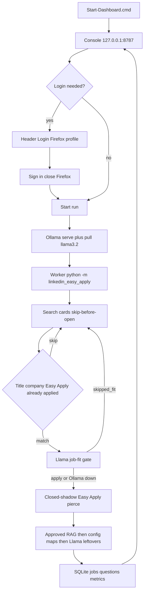
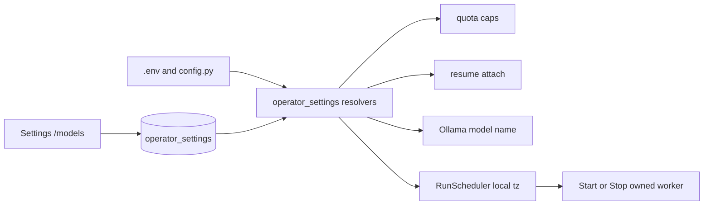

# Architecture

`Start-Dashboard.cmd` serves the operator console on `127.0.0.1:8787`. That is the daily
entrypoint. **Start run** launches `python -u -m linkedin_easy_apply` from the project
`.venv` after ensuring Ollama. `Start-Bot.cmd` remains an optional headless fallback.
Job outcomes are stored in `data/assistant.sqlite`; daily text logs are still written and imported into
SQLite. The console script in `linkedin_easy_apply.cli` validates configuration, waits if the Firefox profile is locked, and
delegates to the workflow in `linkedin.py`. Human pacing and application caps live in
`linkedin_easy_apply.pacing` and `linkedin_easy_apply.quota`. Browser lifecycle is owned by
`Linkedin`; `finally` guarantees cleanup. Search URL generation and audit persistence remain isolated
in `utils.py`, while `config.py` contains non-secret policy and truthful answer mappings.

## Operator-facing flow

During Easy Apply, known contact fields and the local resume file (if configured)
are filled, then operator-approved SQLite answers, then specific config Yes/No and
years-of-experience bootstrap maps, then a local Ollama model for leftovers. Title
and company allow/deny lists skip mismatched search cards before the job page
opens. After those filters, a local Llama **job-fit gate** scores the search-card snippet (or
the job description if the snippet is short) and skips junk (`skipped_fit`) when
fit is below 0.55 or the model says skip. Ollama being down skips the gate, not
the run. Required fields that still have no grounded answer skip that job as
`needs_review`. The current LinkedIn SDUI modal lives in a closed shadow root on
`#interop-outlet[data-testid='interop-shadowdom']`. The worker pierces that tree with Selenium
`element.shadow_root` (JavaScript `el.shadowRoot` is null for closed roots), then walks nested closed
shadows for the dialog, footer Next/Review/Submit, and combobox fields. Job-page carousel
`aria-label="Next"` controls are ignored. Each form step is reacquired after navigation because LinkedIn
replaces DOM nodes during modal transitions. If a local Ollama model is running, it
receives the visible form text plus applicant facts and returns short JSON answers. Every
screening field observed during Easy Apply is upserted into SQLite `questions` for later
operator approval and retrieval. Unknown long-form questions
still produce a local diagnostic rather than invented essays.

Approved dashboard answers are **RAG memory**, not a fine-tune. Approving a Questions
row stores `approved_value` in SQLite. The next matching field looks that row up.
Ollama weights stay frozen. Seed questions insert pending-only rows. Classification
treats LinkedIn email placeholders as `email` with `answer_shape=text`, never a
select of `[email]`. See [local Llama sidecar](llm.md).

Every job the worker considers (opened or skipped from the search card) is stored with
`location_text`, `sector`, `market`, and `outcome` (`applied` / `skipped` / `failed`).
A keyword taxonomy classifies title+company+snippet first. Llama may refine only when
the job page is already open and Ollama is ready. `GET /api/metrics` aggregates those
columns with SQL `GROUP BY` for today and the last 7 days. See [operator metrics](metrics.md).

## Module map

| Area | Owner |
|---|---|
| Browser workflow | `linkedin.py` |
| Search URLs and audit files | `utils.py` |
| Bootstrap maps and search filters | `config.py` |
| CLI / `--dashboard` / `--login` | `linkedin_easy_apply.cli` |
| Operator console | `linkedin_easy_apply.dashboard.app` |
| Worker process + heartbeat | `linkedin_easy_apply.worker` |
| Closed-shadow modal detection | `linkedin_easy_apply.modal_detection` |
| Search-card parse / skip-before-open | `linkedin_easy_apply.job_card` |
| Llama job-fit gate | `linkedin_easy_apply.job_fit` |
| Ollama JSON generate | `linkedin_easy_apply.llm` |
| Approved-answer RAG | `Store.retrieve_approved_answers` |
| Seed catalog | `linkedin_easy_apply.question_generator` |
| Kind / wording classify | `linkedin_easy_apply.question_classifier` |
| Sector / market / location | `linkedin_easy_apply.job_metrics` |
| Caps | `linkedin_easy_apply.quota` |
| SQLite overlay for model, resume, caps, schedule | `linkedin_easy_apply.operator_settings` |
| Auto Start/Stop from schedule windows | `linkedin_easy_apply.scheduler` (`RunScheduler`) |

The dashboard process and the worker process open **short-lived WAL** connections with
`busy_timeout=2500`. Questions approve/reject run in a thread pool so a SQLite wait
cannot freeze Live `/api/status`. Neither process holds a connection across an HTTP
request or a Selenium step. See [dashboard isolation](dashboard.md).

## SQLite schema migration

`Store.initialize` is additive and must not rebuild operator data:

1. `CREATE TABLE IF NOT EXISTS` for `runs`, `jobs`, `events` **without**
   `idx_jobs_seen_outcome`. `CREATE TABLE IF NOT EXISTS` does not add `outcome` to a
   legacy `jobs` table; putting that index in the same script aborts init with
   `sqlite3.OperationalError: no such column: outcome`.
2. `_ensure_jobs_schema` `ALTER TABLE`s `location_text`, `sector`, `market`,
   `outcome`, `metrics_json` when missing, then creates indexes only if the
   required column exists.
3. Questions capture tables are never dropped. Missing columns such as
   `cleaned_question` / `classified_kind` are `ALTER`ed in.
4. `operator_settings` and `chat_messages` are created if missing.

Daily `.txt` logs are imported on dashboard start so older applies are not lost.

## Operator settings overlay

SQLite `operator_settings` overrides `ollama_model`, `resume_path`,
`applicant_summary`, `max_applications_per_run`, `max_applications_per_day`, and
`schedule_windows` without editing committed `config.py`. The console **Settings**
page (`/models`, also `/settings`) is the editor: Ollama picker + pull, resume PDF
upload into `data/resumes/` (gitignored), daily/run caps, and local-timezone
schedule windows. `.env` remains the fallback (`OLLAMA_MODEL`,
`LINKEDIN_RESUME_PATH`, `LINKEDIN_MAX_APPLICATIONS_PER_*`).

`run_dashboard` starts `RunScheduler` (`enable_scheduler=True`). Empty windows mean
**manual Start only**. Windows use the machine local timezone. A closed window
stops the owned worker tree, not Ollama.

Future refactoring should move `linkedin.py`, `config.py`, `constants.py`, and `utils.py` fully beneath the package
without changing the public CLI entry point.
