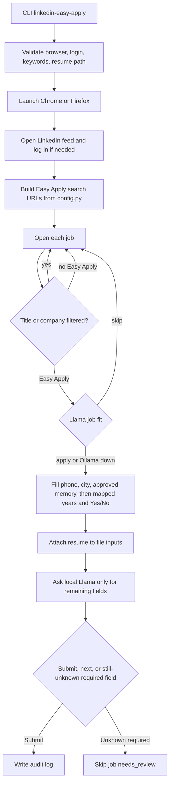
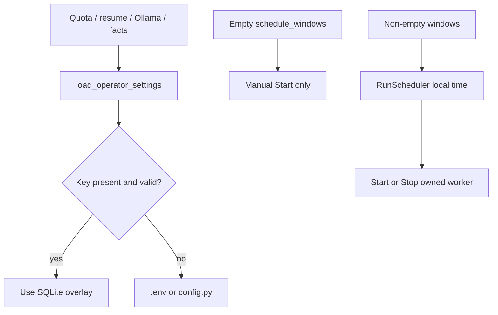

# Configuration

Runtime secrets and personal information are read from environment variables. Copy `.env.example` to
`.env` for local use. The `.env` file is ignored by Git.

## Feature purpose

Local configuration tells the assistant which LinkedIn Easy Apply jobs to open, which contact and
screening values are truthful, and which resume file to attach. Search filters live in `config.py`.
Secrets stay in `.env`.

## Scope

In scope: browser choice, login source, job search filters, phone/city, years-of-experience
answers, Yes/No mappings, resume path, and title/company skip lists.

Out of scope: CAPTCHA, multifactor authentication, cookie theft, and sending the resume to a remote model.

## Inputs and outputs

| Variable | Required | Purpose |
|---|---:|---|
| `FIREFOX_PROFILE_PATH` | Recommended when using Firefox | Reuses an authenticated Firefox profile so a password does not need to be stored |
| `LINKEDIN_EMAIL` | Optional fallback | Login fallback when no authenticated profile is available |
| `LINKEDIN_PASSWORD` | Optional fallback | Login fallback password |
| `LINKEDIN_PHONE_NUMBER` | Optional | Easy Apply contact forms |
| `LINKEDIN_APPLICATION_CITY` | Optional | City autocomplete on contact forms |
| `LINKEDIN_RESUME_PATH` | Optional | Absolute path to a local resume PDF. If unset, the first `*Resume*.pdf` in the project root is used |
| `LINKEDIN_PROFILE_URL` | Optional | Public profile URL for leftover non-LinkedIn adapters |
| `APPLICANT_FIRST_NAME` | Optional | First name for leftover non-LinkedIn adapters |
| `APPLICANT_LAST_NAME` | Optional | Last name for leftover non-LinkedIn adapters |
| `LINKEDIN_PACE` | Optional | `human` (default) or `fast` |
| `LINKEDIN_MAX_APPLICATIONS_PER_RUN` | Optional | Successful applies allowed in one run. Default `12` |
| `LINKEDIN_MAX_APPLICATIONS_PER_DAY` | Optional | Successful applies allowed per **local** calendar day. Default `25` |
| `LINKEDIN_LLM` | Optional | `auto` (default), `ollama`, or `off` |
| `OLLAMA_HOST` | Optional | Local Ollama URL. Default `http://127.0.0.1:11434` |
| `OLLAMA_MODEL` | Optional | Default `llama3.2`. SQLite `operator_settings.ollama_model` wins when set |
| `LINKEDIN_JOB_FIT_THRESHOLD` | Optional | Skip listings when Llama fit is below this (0-1). Default `0.55` |
| `LINKEDIN_APPLICANT_SUMMARY` | Optional | Extra truthful facts for short text questions |

Outputs are written under `data/` (ignored by Git): application audit log, failure screenshots, and
saved HTML for selector diagnosis.

## Dependencies

- Python 3.10–3.12
- Firefox or Chrome
- `selenium`, `webdriver-manager`, and `python-dotenv`
- A LinkedIn account the operator controls
- Optional local resume PDF

## Functional flow

## Failure paths

- Missing Chrome/Firefox login source fails `--check` before a browser opens.
- A configured resume path that does not exist fails `--check`.
- CAPTCHA, 2FA, or a security checkpoint must be finished in the visible browser window.
- Unknown required screening questions are not invented as essays. Approved memory
  and mapped config fill first. A local Ollama model may fill leftover short fields
  from facts. If a required field is still empty, that job is skipped (`needs_review`).
  A separate Llama job-fit gate can skip junk listings (`skipped_fit`) when Ollama is
  ready; if Ollama is down the gate is skipped and the run continues.
- LinkedIn can rate-limit or restrict automated activity. Slow down or stop if that happens.

## Security considerations

Never put a password, session cookie, phone number, resume, or browser profile path in a committed
file. Use `.env`, keep `data/` local, and rotate credentials if they were ever shared. The assistant
does not bypass security checks.

## Performance considerations

Each keyword and location pair becomes a search URL. Keep the keyword list focused. Title, company,
and Easy Apply filters run on the search card **before** the job page opens, so intern/staffing/unrelated
titles never pay the job-view delay.

## Firefox profile

Prefer `FIREFOX_PROFILE_PATH` over storing `LINKEDIN_EMAIL` and `LINKEDIN_PASSWORD`.

1. Use a dedicated Firefox profile directory (this checkout uses `Profiles\linkedin-easy-apply`).
2. Open that profile once from the dashboard **Login** control (or `linkedin-easy-apply --login`), complete LinkedIn login including any CAPTCHA or 2FA, and confirm the feed loads.
3. Close every Firefox window that is using that profile. Selenium cannot open a profile that is already running.
4. Click **Start run** on the dashboard. You do not need `Start-Bot.cmd` for daily use.

## Human pacing

Default `LINKEDIN_PACE=human` waits 10-22 seconds on a job, types contact fields key by key, waits
18-40 seconds after a successful apply, and pauses longer every 7 jobs. The assistant also stops at
12 successful applies per run and 25 per **local** calendar day. These caps reduce restriction risk; they do not make
automated use safe.

See [running documentation](running.md).

## Operator settings overlay

### Feature purpose

Let a localhost operator override model, resume file, applicant summary, apply
caps, and optional run windows **without rewriting `config.py`**. Values live in
`data/assistant.sqlite` table `operator_settings`.

### Scope

In scope on disk: resolvers in `linkedin_easy_apply.operator_settings` that quota,
resume attach, facts, and Ollama already call; `RunScheduler` for local-timezone
windows; resume files intended for `data/resumes/` (gitignored).

Out of scope: rewriting committed `config.py` search keywords. Change model,
resume, caps, and schedule from dashboard **Settings** (`/models`). `.env`
remains the fallback when SQLite has no override.

### Inputs and outputs

| Key | Purpose |
|---|---|
| `ollama_model` | Overrides `OLLAMA_MODEL`. Names must look like `llama3.2` |
| `resume_path` | Absolute local PDF path used when the file still exists |
| `applicant_summary` | Extra truthful facts (capped at 2000 chars) |
| `max_applications_per_run` | Integer cap, max 500 |
| `max_applications_per_day` | Integer cap, max 500, **local** calendar day |
| `schedule_windows` | JSON list of `{days, start, end}`. Empty = manual Start only |

`days` are Monday=0 … Sunday=6 (names `mon`…`sun` also parse). `start` / `end`
are `HH:MM`. Comparison uses `datetime.now().astimezone()` — the operator's
**local timezone**, not UTC. A window with `start == end` is inactive.

Resolution order: SQLite override if valid, else `.env` / `config.py` defaults
(12 / 25, `llama3.2`, `LINKEDIN_RESUME_PATH` or the first `*Resume*.pdf` in the
project root).

### Dependencies

- Same `assistant.sqlite` as jobs/questions
- Dashboard **Settings** (`/models`) to write keys
- `linkedin_easy_apply.scheduler.RunScheduler` (20s tick; started by
  `run_dashboard` with `enable_scheduler=True`)

### Functional flow

### Failure paths

- Invalid model name is rejected by `normalize_model_name`.
- Resume override is ignored when the path is missing; config fallback is used.
- Invalid schedule JSON reports `reason: invalid schedule` and does not auto-start.
- Caps above 500 are clamped. Missing keys keep env defaults.
- Pytest does not open the real `data/assistant.sqlite` unless `LINKEDIN_STORE_PATH` is set.

### Security considerations

Overrides stay on localhost SQLite. Resume bytes are never committed (`*.pdf` and
`data/` are gitignored). Secrets stay in `.env`. Do not put a password in
`operator_settings`.

### Performance considerations

Settings reads are small key lookups. Scheduler ticks at least every 5s (default
20s) and must not kill the dashboard on error.

## Search and answer policy

Non-secret search filters and truthful screening **bootstrap maps** currently live
in `config.py`. They are keyword lookups, not Llama training. Generic catch-alls
(`experience → Yes`, `years_experience["default"]`) are omitted; unmatched
questions stay empty for approved memory or Ollama. A local Llama sidecar can fill
leftover short fields; see [llm.md](llm.md).

Current local search policy:

- Browser: Firefox with `FIREFOX_PROFILE_PATH`
- Pace: human, 12 applies per run and 25 per day
- Location: United States
- Work mode: Remote and Hybrid
- Seniority: Associate and Mid-Senior
- Salary floor: $120,000+
- Date: Past Week
- Resume: `Tapiwa_Chikwenya_Resume_09_17_2026.pdf` in the project root
