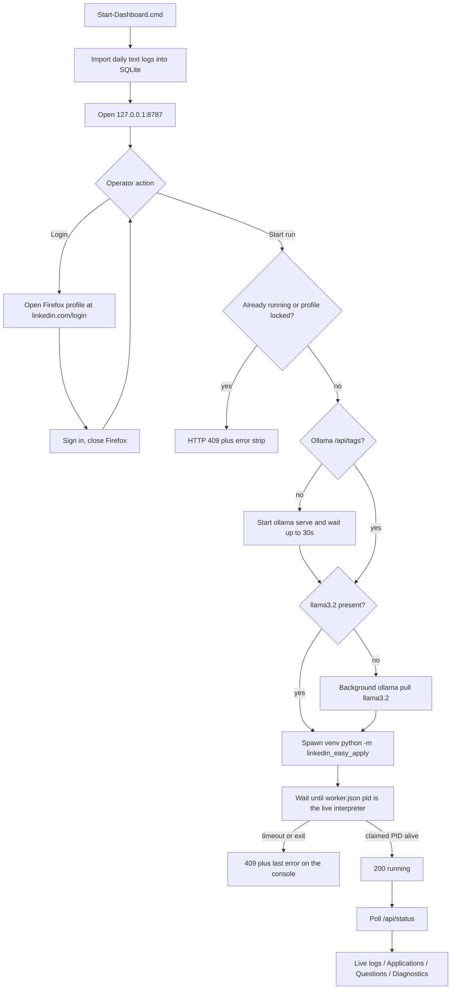
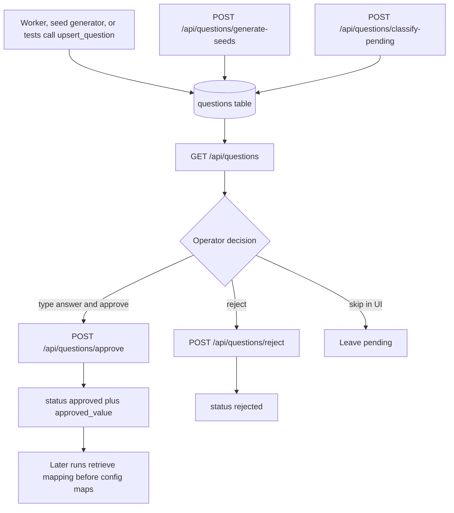
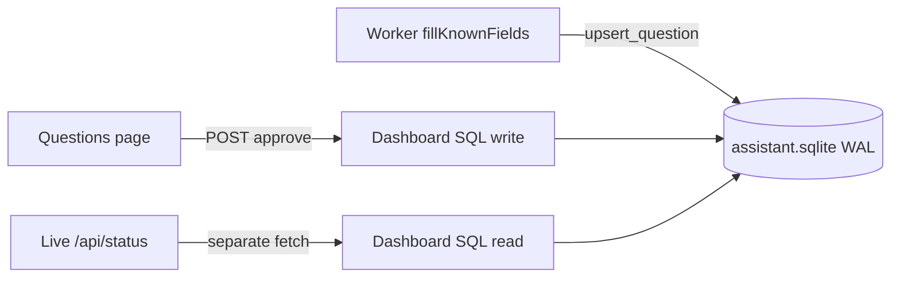
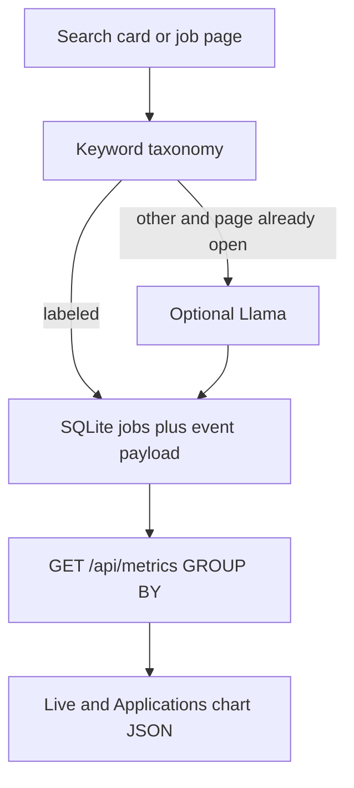
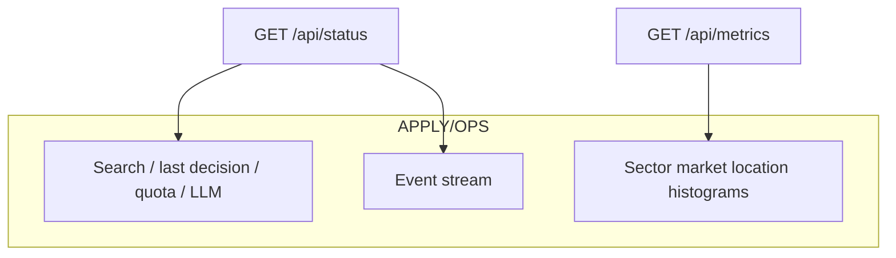
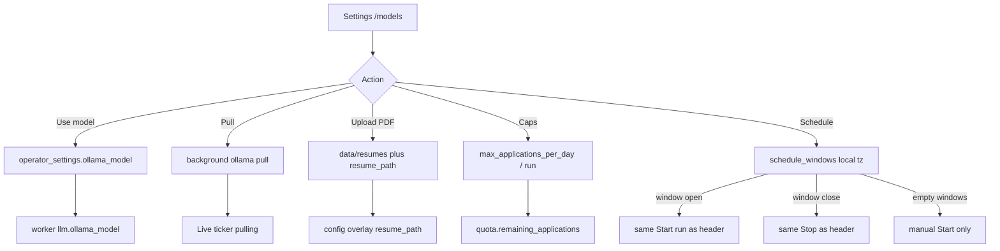
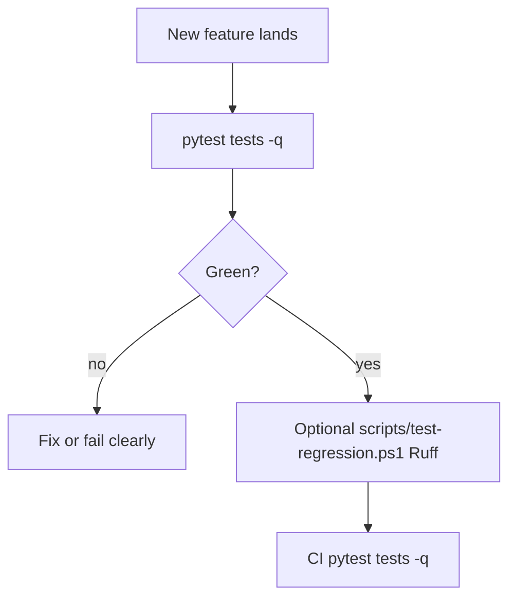
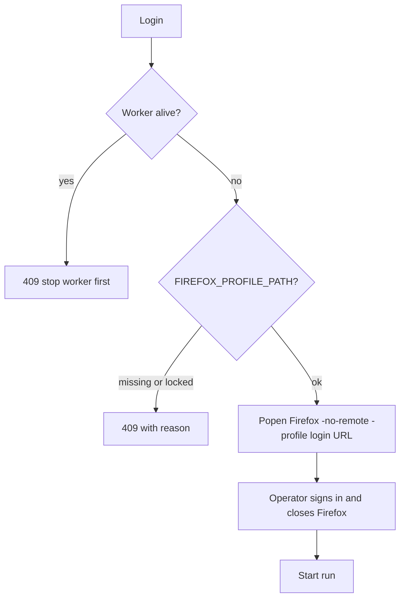

# Operator dashboard

## Feature purpose

Give a localhost operator console for one-click start of Ollama plus the Easy Apply
worker, LinkedIn login, live logs, searchable application history, question review, and
failure screenshots. SQLite is the source of truth. Daily text logs are imported on
startup so older runs are not lost.

The only remaining Explorer shortcut is `Start-Dashboard.cmd`. After
`http://127.0.0.1:8787` is open, **Start run** is Ollama + worker. You do not need
`Start-Bot.cmd` or `Start-Ollama.cmd`.

## Scope

In scope: `data/assistant.sqlite`, log import, Live / Applications / Questions /
Diagnostics / **Settings** pages, one-click Start (Ollama then worker), Login (same
Firefox profile flow as `--login`), Stop of the owned worker tree, optional Stop
Ollama, localhost-only HTTP, questions review JSON API, and Settings APIs for
model / resume / caps / local-timezone schedule.

Out of scope: fine-tuning Llama, submitting answers to LinkedIn from the
dashboard, and stopping a user-owned Ollama app the dashboard did not start.
`Start-Bot.cmd`, `Start-Ollama.cmd`, and `Login-LinkedIn.cmd` are optional
fallbacks, not part of the daily path. Job-fit scoring runs in the worker; Live
exposes `last_fit` from `/api/status` without a dashboard restyle.

## Inputs and outputs

| Input | Purpose |
|---|---|
| Double-click `Start-Dashboard.cmd` | The only required shortcut. Serves `http://127.0.0.1:8787` |
| `linkedin-easy-apply --dashboard` | Same, after the venv is active |
| **Start run** | Starts local Ollama if needed (serve + pull `llama3.2`), then the Easy Apply worker |
| **Login** | Opens the bot Firefox profile at LinkedIn login. Close Firefox before Start run |
| **Stop** | Terminates the owned worker/python/geckodriver tree only |
| **Stop Ollama** | Stops the `ollama serve` process this dashboard started |
| `GET /api/questions` | List captured Easy Apply questions; **repairs live SQLite** so email is not a select of `[email]` |
| `POST /api/questions/generate-seeds` | Insert pending seed questions; returns `{inserted, skipped, candidates}` |
| `POST /api/questions/approve` | Persist `approved_value` and status `approved` |
| `POST /api/questions/reject` | Persist status `rejected` |
| **Settings** (`/models`) | Ollama picker, PDF resume upload, daily/run caps, local-timezone schedule, model chat |
| `GET`/`POST /api/settings` | Read/write SQLite overlay (model, caps, schedule, summary) |
| `POST /api/resumes` | Upload PDF into `data/resumes/` and set it active |
| `POST /api/login` | Same origin; same Firefox `--login` flow |

Outputs: `data/assistant.sqlite`, reused `data/easy_apply_*` and `data/job_load_*` artifacts, existing daily `.txt` files.

## Dependencies

- FastAPI, Uvicorn, Jinja2
- Existing `.venv`, Firefox profile, and worker CLI
- Local Ollama (`ollama serve` / `llama3.2`). Start run launches it when missing.
  Leaving Ollama running uses RAM (often 2GB+ for `llama3.2`) so later starts stay warm.
  Install Ollama itself once from https://ollama.com/download.

## Functional flow



## Questions review API

### Feature purpose

Let the operator see every captured Easy Apply question, generate extra pending
seed prompts, type an answer, and approve or reject it. Approved values become
local RAG mappings for the worker and Llama. The dashboard never submits to
LinkedIn and never fine-tunes the model.

### Scope

In scope: SQLite `questions` rows, JSON list/filter, same-origin approve/reject,
same-origin seed generation, masking of email/phone in API responses.

Out of scope: HTML for a second questions schema, bulk-approve (no endpoint), Skip as a
persisted status (Skip is UI-only and leaves `pending`). The Questions page in the
console calls these JSON routes.

### Inputs and outputs

`question_id` is the integer `questions.id`. Store lookups also accept normalized
question text. Prefer the integer id from `GET /api/questions`.

`GET /api/questions?status=&q=&kind=`

| Query | Meaning |
|---|---|
| `status` | `pending`, `approved`, `rejected`, or empty for all |
| `q` | Search question text, proposed/approved values, last job title/company |
| `kind` | Exact field kind, case-insensitive (`text`, `select`, `number`, …) |

Response:

```json
{
  "questions": [
    {
      "question_id": "12",
      "question_text": "Years of SQL?",
      "kind": "number",
      "options": [],
      "proposed_value": "9",
      "approved_value": "",
      "prefill": "9",
      "status": "pending",
      "source": "seed",
      "seen_count": 2,
      "last_job_id": "4466303632",
      "last_job_title": "Azure Data Engineer",
      "last_job_company": "Northwind",
      "created_at": "...",
      "updated_at": "..."
    }
  ],
  "counts": {"pending": 1, "approved": 0, "rejected": 0, "total": 1},
  "kinds": ["number"]
}
```

`POST /api/questions/generate-seeds` is same-origin and returns
`{ "inserted": 12, "skipped": 0, "candidates": 12, "source": "seed", "counts": {...} }`.
It inserts pending rows only.

`POST /api/questions/approve` and `POST /api/questions/reject` accept JSON or
`application/x-www-form-urlencoded` from the same origin:

```json
{"question_id": "12", "approved_value": "9"}
```

```json
{"question_id": "15"}
```

Approve requires a non-empty `approved_value` (matched to an option when present).
Reject only needs `question_id`. Both return `{ "question": {...}, "counts": {...} }`.

Store helpers: `list_questions`, `get_question`, `approve_question` /
`approve_answer`, `reject_question`, `question_counts`, `question_kinds`,
and `record_question` / `upsert_question` for capture. Status lives in
`approval_status` (`pending|approved|rejected`). Display kind is
`classified_kind` (fallback `field_kind`). Display title is `cleaned_question`.
Merged duplicates and file/resume rows are omitted from `list_questions`.

`POST /api/questions/classify-pending` runs heuristic leftovers and, when
Ollama is ready, a capped Llama polish (`max 8`, 8s timeout per question).
`GET /api/questions`, approve, reject, and generate-seeds do not call Ollama.

### Functional flow



### Failure paths

- Unknown `question_id` returns HTTP 404 and does not change SQLite.
- Empty `approved_value` returns HTTP 400.
- Cross-origin `Origin` or `Referer` on approve/reject/generate-seeds/classify-pending returns HTTP 403.
- Email and phone in list responses are replaced with `[email]` / `[phone]`.
  Captured contact `proposed_value` stays redacted. Pending email/phone rows may
  `prefill` from `config.email` / `config.phone_number` so the operator can type
  or confirm the real value on approve; `[email]` is never offered as a select
  option. Resume text is never included.
- `GET /api/questions` repairs email/phone rows that LinkedIn stored as `select`
  of placeholders (for example `[email]` / Select an option) and merges email
  clusters before returning the list. Approve, reject, and generate-seeds do not
  start the LinkedIn worker, do not call Ollama, and do not wait on Selenium.
  Approve is a short SQLite write (`approved_value` plus `approval_status`). If
  the worker holds a write lock during `fillKnownFields` upserts, the dashboard
  waits up to 2.5s (`busy_timeout`) then returns HTTP 503.
- `generate-seeds` is CPU/SQL only and caps inserts at 80 per click.
- `classify-pending` may call local Ollama for wording only; heuristics still
  classify email/phone/years if Llama is down. Max 8 questions per request.

### Isolation guarantee

Questions are a local SQLite review queue. The worker process and the dashboard
process open short-lived WAL connections with `busy_timeout=2500`. Neither holds
a connection across an HTTP request. Approve/reject run in a thread pool so a
brief SQLite wait cannot freeze the Uvicorn event loop or Live `/api/status`
polling. Live status uses a separate `fetch` plus `AbortController` timeout so
a questions POST cannot stall the header poll.



### Security considerations

Mutations require same-origin `Origin` or `Referer` when those headers are
present. The server still binds to `127.0.0.1` only. Approved answers stay in
local SQLite; they are not uploaded and are not used to fine-tune Ollama.

### Performance considerations

List queries are indexed on `status` and `kind` and capped at 300 rows.

### Questions page

The console Questions view is an operator memory queue: pending / approved /
rejected filters, search, kind, and a **Generate seed questions** action that
calls `POST /api/questions/generate-seeds` and shows how many rows were inserted.
Each row shows cleaned question text (repeated labels collapsed, not concatenated
raw capture), options, a kind badge (email, years,
yes/no, text, …), source, `seen_count`, last job title/company, proposed value,
an answer field, Approve, Reject, and client-side Skip.
Email is never a `<select>` of `[email]`. Heuristics treat LinkedIn placeholder
options (`Select an option`, `[email]`, `email addresses`) as kind `email`,
cleaned title **Email**, `answer_shape=text`. The answer control is
`<input type="email">`. `GET /api/questions` runs `repair_contact_classifications`
on the live SQLite file so already-stored select rows are rewritten before the
list returns. **Refresh Questions** after a worker capture or after upgrading
the dashboard to see the repaired title and text input. Phone follows the same
placeholder path (`tel`). The page also calls `POST /api/questions/classify-pending`
once after load so Llama can polish wording; heuristics already ran on capture.
Skip only hides the row in this browser session. There is no bulk-approve.
Seed rows stay pending until you approve them; that is how RAG memory grows.
The **Generate seed questions** control is the highlighted panel at the top of
`/questions` (`#seeds`). Empty pending tables link back to that panel.

Live always shows a CTA: `N questions need answers` → `/questions` when pending
is greater than zero, otherwise `Generate seed questions` → `/questions#seeds`.
The header ticker **PENDING Q** also links to `/questions`.

Origin chips filter the table by `linkedin` (captured / mapped), `seed`, or `llm`.
`A` approves the selected row and `R` rejects it when focus is not in an input.
Per-row Approve remains. Skip is still UI-only.

## Visual system

The console stays a dark APPLY/OPS operator desk: near-black (`#030404`), lime
(`#d6ff3c`) and cyan (`#3ee0ff`) on IBM Plex Mono, tabular numbers, monospace
job ids. A faint 8px grid and static CRT scanlines sit under the tape. Charts
use a tick grid and a crosshair cursor. Status lamps glow; they do not bounce.
No purple, no emoji, no card chrome.

Motion is 180–240ms with a sharp ops ease and is disabled under
`prefers-reduced-motion`. Start run ignites Ollama then worker lamps in sequence.
New event rows slide in. Applied and pending counts count up. Histogram fills
animate width. Apply is lime, skip is amber, fail is red.

Header keys: `S` start, `X` stop, ignored while typing in an input.

The header **FIT** ticker reads `/api/status` `last_fit`
`{score, decision, line, error_kind}` even when `/api/metrics` is empty or fails.
A generate timeout shows `timeout` on FIT and `llm.last_fit_error`; the LLM chip
stays ready when Ollama is up. Apply is lime, skip is amber.
`Job fit llama=0.82 apply` and `Skipped before open: intern. Job: <url>` are
colored in the event stream the same way. Pre-click card skips never open the
job page; Live still shows them as amber skip rows. Applications keeps a Fit
column when `fit_score` is present.

## Metrics views

### Feature purpose

Show where the book is concentrating: industry sector, finer market, location,
and applied vs skipped. SQLite columns are the source of truth; the console
charts consume `GET /api/metrics`.

### Scope

In scope: persist `location_text`, `sector`, `market`, `outcome` on `jobs` and
skip-event `payload_json`; keyword taxonomy; optional Llama classify only when
the job page is already open; backfill; `GET /api/metrics` SQL aggregations for
today and the last 7 days.

Out of scope: restyling the dashboard (charts already read this JSON), paid
labor-market data, LinkedIn's official industry taxonomy.

### Inputs and outputs

`GET /api/metrics` returns both windows plus the chart-shaped aliases the UI
already renders (`applied_vs_skipped`, `sectors`, `markets`, `locations`).

```json
{
  "source": "store",
  "today": {
    "since": "2026-09-18T00:00:00+00:00",
    "until": "2026-09-18T15:00:00+00:00",
    "totals": {"applied": 3, "skipped": 11, "failed": 1, "seen": 0, "total": 15},
    "by_sector": [{"key": "technology", "applied": 2, "skipped": 4, "failed": 0, "seen": 0, "count": 6}],
    "by_market": [{"key": "data", "applied": 2, "skipped": 3, "failed": 0, "seen": 0, "count": 5}],
    "by_location": [{"key": "United States", "applied": 3, "skipped": 8, "failed": 1, "seen": 0, "count": 12}],
    "by_outcome": [{"key": "applied", "count": 3}]
  },
  "last_7_days": {},
  "taxonomy": {
    "sectors": ["healthcare", "finance", "insurance", "government", "staffing", "technology", "other"],
    "markets": ["hospital", "health", "bank", "fintech", "insurance", "government", "staffing", "recruiting", "software", "data", "other"]
  },
  "applied_vs_skipped": {"applied": 3, "skipped": 11, "failed": 1},
  "sectors": [{"label": "technology", "applied": 2, "skipped": 4, "failed": 0, "total": 6}],
  "markets": [{"label": "data", "applied": 2, "skipped": 3, "failed": 0, "total": 5}],
  "locations": [{"label": "United States", "applied": 3, "skipped": 8, "failed": 1, "total": 12}]
}
```

See [operator metrics](metrics.md) for taxonomy, persist path, and failure modes.

### Functional flow



### Failure paths

Empty history returns zeroed histograms. Unknown titles map to `other`.
Missing location maps to `(unknown)`. Llama down or invalid JSON keeps the
taxonomy label. Classification is keyword-first and will mis-tag some hybrids.
Live and Applications chart **only** `GET /api/metrics`. A 500 or thrown
response paints empty histograms and does not take down the page, last fit,
or the event stream. `/api/status` still returns `last_fit` when metrics fail.



### Security considerations

Metrics only expose job titles, companies, locations, and counts already on the
localhost applications table. No resume text. Llama classify sends only
title/company/snippet.

### Performance considerations

Persist is one SQLite transaction per job. Aggregations are SQL `GROUP BY` on
`seen_at` plus dimension columns, not a Python scan of 400 rows. Llama classify
is skipped unless the page is already open and taxonomy is `other`. Histogram
fills animate 240ms; Live polls `/api/metrics` every 4s and skips a repaint when
counts are unchanged.

## Settings (models, resume, caps, schedule)

### Feature purpose

Let the operator pick a local Ollama model, upload a resume PDF, set daily/run
caps, and define local-timezone run windows without editing `config.py`. Values
land in SQLite `operator_settings`. Resume bytes stay under `data/resumes/`
(gitignored).

### Scope

In scope: header **Settings** (`/models` and `/settings` render `models.html`),
Ollama picker + pull, PDF upload / activate / delete, cap editors, schedule
day chips + start/end, optional model chat (local history in `chat_messages`),
`RunScheduler` started from `run_dashboard`.

Out of scope: rewriting `config.py` keywords/salary, fine-tuning, uploading the
resume off-box. Empty schedule windows stay **manual Start only**.

### Inputs and outputs

| Control | API | Notes |
|---|---|---|
| Use model | `POST /api/models/active` | Writes `ollama_model`. `.env` `OLLAMA_MODEL` is fallback |
| Pull model | `POST /api/models/pull` | Background pull; Live ticker shows progress |
| Save caps | `POST /api/settings` | `max_applications_per_day` / `_run`, local calendar day |
| Save window | `POST /api/settings` | `{days, start, end}` in **machine local time** |
| Clear schedule | `POST /api/settings` `{schedule_windows: []}` | Manual Start only |
| Upload PDF | `POST /api/resumes` multipart | PDF only, ≤10MB, becomes active path |
| Chat | `POST /api/models/chat` | Optional resume excerpt; passwords redacted |

Storage:

- Active model and resume path, caps, schedule, summary: SQLite `operator_settings` in `data/assistant.sqlite`
- Chat history: SQLite `chat_messages` (capped)
- Resume bytes: `data/resumes/*.pdf` (gitignored, never committed)



Live ticker **CAPS** shows remaining today using the overlay. **SCHED** is `manual`, `open`, or `outside`. Start is disabled with “Outside schedule” when a window is set and now is outside it.

### Security considerations

Chat never sends `LINKEDIN_PASSWORD`. Resume files stay on localhost under `data/`. Mutations require same-origin.

### Performance considerations

Tags and chat use short dedicated timeouts in a thread pool so a hung Ollama generate cannot stall Live `/api/status`. Pull is background `ollama pull`.

### Failure paths

- Ollama down: Settings still saves caps/schedule/resume; model list and chat return 503.
- Invalid model name: HTTP 400. Invalid schedule: HTTP 400.
- Deleting the resume the running worker is using: HTTP 409.
- SQLite busy: HTTP 503.
- Start clicked outside a defined window: HTTP 409 `Outside schedule.`

See [configuration](configuration.md#operator-settings-overlay).

### Tests and regression gate

**Purpose:** Keep the Settings page (`/models`), Ollama picker, resume upload, chat,
caps, and schedule honest whenever new features land. Tests talk to FastAPI
`TestClient` and mock Ollama (`GET /api/tags`, `/api/chat`, `ollama pull`
subprocess). They never start the LinkedIn worker and never pull large models
on the host.

**Scope:** `tests/test_models_settings.py` plus overlapping dashboard, store, and
question tests. The default gate is the **full** suite:

```powershell
python -m pytest tests -q
```

That command is configured in `pyproject.toml` (`testpaths = ["tests"]`,
`addopts = "-q"`). `scripts/test-regression.ps1` wraps it and then runs Ruff.
GitHub Actions (`.github/workflows/ci.yml`) runs the same pytest invocation.
Do not treat a feature as done until `pytest tests -q` is green.

**Inputs / outputs:** mocked Ollama JSON, tmp SQLite, PDF bytes written under the
test `data/resumes/` folder. Assertions cover model list, active-model persist
(`llm.ollama_model()` / `/api/status`), background pull, chat without passwords,
PDF-only resume size cap, gitignore, caps/schedule, Questions 200, email
select→text repair, and legacy `jobs` table init without `outcome`.

**Failure paths:** Ollama down → 503 on list/chat; invalid model → 400; `.exe` /
`.txt` / oversized upload → 400; cross-origin mutations → 403; deleting the
resume a live worker is using → 409.



## LinkedIn Login

### Feature purpose

Open the configured Firefox profile at `https://www.linkedin.com/login` from the
console so the operator does not need `Login-LinkedIn.cmd`. This is the same
`--login` flow: `-no-remote -profile FIREFOX_PROFILE_PATH`. It does not start the
Easy Apply worker.

### Scope

In scope: `POST /api/login`, header **Login** control, same-origin check, refuse
when a worker is already alive, refuse when the profile is locked or missing.

Out of scope: storing LinkedIn passwords, automating CAPTCHA or 2FA, keeping
Firefox open after login.

### Inputs and outputs

`POST /api/login` (JSON, same origin).

Success:

```json
{
  "ok": true,
  "message": "Firefox opened at LinkedIn login. Sign in, confirm the feed loads, then close that Firefox window before Start run."
}
```

Failure is HTTP 409 with `{ "ok": false, "error": "..." }` shown on the red error
strip and on Live when there is no current job.

### Functional flow



### Failure paths

- Missing `FIREFOX_PROFILE_PATH`: 409, tell the operator to set it in `.env`.
- Profile locked: 409, close other Firefox windows that use this bot profile.
- Worker running: 409, Stop the worker first. The profile cannot be shared.
- Firefox binary missing: 409 with the FileNotFoundError text.
- Cross-origin Origin/Referer: HTTP 403. Does not spawn Firefox.

### Security considerations

Login only binds to localhost and only opens the local Firefox profile. Credentials
are entered in Firefox, not posted to the dashboard.

## One-click Start

### Feature purpose

One dashboard click must bring up Ollama (if needed) and the Easy Apply worker, then
report running or an actionable error. The POST does not return 200 while the run is
already crashed. The header contract is **Start run = Ollama + worker**.

The ticker shows worker phase, LLM ready, Ollama process/pull, context tokens
when known, current search keyword/location, pace, applies today vs caps, and
pending-question count.

### Failure paths

- Missing `.venv` Python: Start uses `project/.venv/Scripts/python.exe` when present,
  otherwise the dashboard interpreter, and writes `data/worker.log`. A missing
  interpreter returns HTTP 409 with the path and "Create .venv in the project folder."
  That string is copied to `last_error` so Live and the red error strip show it, not
  only the JSON body.
- Ollama missing from PATH: Start searches well-known install dirs, then shows the
  download URL. The worker can still start with mapped answers only; the status header
  keeps the Ollama error visible. If the worker also fails, both reasons are joined
  in `error` / `last_error`.
- Model missing: `ollama pull llama3.2` runs in the background. The header shows
  `pulling model` and does not block forever.
- A locked Firefox profile returns HTTP 409: close other Firefox windows that use this
  bot profile. Start does not spawn a second worker.
- If a worker is already alive, Start is disabled in the header (label becomes
  `Running`) and `POST /api/run/start` returns HTTP 409 `A worker is already running.`
  Stop becomes the primary control until the owned worker tree exits.
- The launched Python worker claims `data/worker.json` with its actual interpreter PID.
  Start waits until that `pid` is alive. A short-lived launcher PID is not treated as
  running. A run is crashed only when the owned worker is gone, its heartbeat is stale,
  and no owned python/geckodriver descendant remains.
- Stop terminates the owned worker PID (`taskkill /T` on Windows). It does not scan for
  or terminate unrelated Firefox processes, and it does not stop Ollama.
- Stop Ollama only kills the `ollama serve` PID recorded in `data/ollama.pid`.
- Artifact URLs only serve `easy_apply_failure_*`, `easy_apply_page_*`, and `job_load_*`.
- `/api/status` includes `linkedin_easy_apply.llm.status()`, `llm_ready`, Ollama
  process/pull flags and `tokens` when known, `search`, `last_job` / `last_decision`,
  `last_fit` (score, decision, log line, and `error_kind` timeout vs unreachable),
  `llm.last_fit_error` when the last gate failed, `metrics`, `groups`, `pace`, quota
  remaining (run and day), pending question counts, `hotkeys`, `last_error`, and the
  start contract string.
- `GET /api/metrics` returns today and last-7-day windows (`by_sector`,
  `by_market`, `by_location`, `by_outcome`) plus chart aliases
  `applied_vs_skipped`, `sectors`, `markets`, `locations`. Live and Applications
  fetch that endpoint for histograms. HTTP 500 yields empty charts, not a dead page.
- Applications filters group `applied` / `skipped` / `failed` and show reason plus
  fit score when present.
- Diagnostics `/api/artifacts` returns `latest_failure` (thumb + reason) plus a
  compact file index, not a dump.

## Troubleshooting

- Questions or `/api/questions` returns 404: the dashboard process is still running an
  older `app.py`. Stop only the dashboard Python on port 8787 (do not `taskkill /T` —
  that can take the worker with it), then start `Start-Dashboard.cmd` again.
- Dashboard exits in ~2s before Uvicorn with `sqlite3.OperationalError: no such column:
  outcome`: a legacy `jobs` table lacked `outcome` while SCHEMA tried to create
  `idx_jobs_seen_outcome`. Current init creates tables without that index, ALTERs
  additive columns, then creates the index only if `outcome` exists. Restart the
  dashboard process only; do not start a second worker.
- Live shows `crashed` while Firefox/geckodriver are still up: confirm `data/worker.json`
  `pid` is the Python process running `linkedin.py`, not a wrapper that already exited.
  The dashboard must keep `alive` true for that PID (or its geckodriver child during
  startup). Stop should `taskkill` only that owned tree.
- Start returns 409 about the Firefox profile: close every Firefox window that opened
  with this bot profile (including a Login window), then Start run again.
- Start fails with a `.venv` path: create the venv from the project folder
  (`python -m venv .venv` then `pip install -e ".[dev]"`) and reopen
  `Start-Dashboard.cmd`.
- Local LLM shows `off` or `Ollama not reachable`: Start run starts `ollama serve`
  when it can. Failed lookups are cached for only two seconds. Install Ollama from
  https://ollama.com/download if the binary is missing. `Start-Ollama.cmd` is only a
  manual fallback. One-click Ollama uses RAM until you Stop Ollama or quit the app.

## Security considerations

The server binds to `127.0.0.1` only. It does not expose `.env`, cookies, or the resume
bytes. Screenshot and HTML diagnostics can contain personal data and stay under `data/`.
`/api/questions` masks email and phone. Approve/reject never auto-submit LinkedIn.

## Performance considerations

The dashboard reads SQLite. The worker remains the rate limiter and application caps
are unchanged. Status polling is every two seconds. Keeping Ollama loaded avoids model
reload latency at the cost of RAM.
