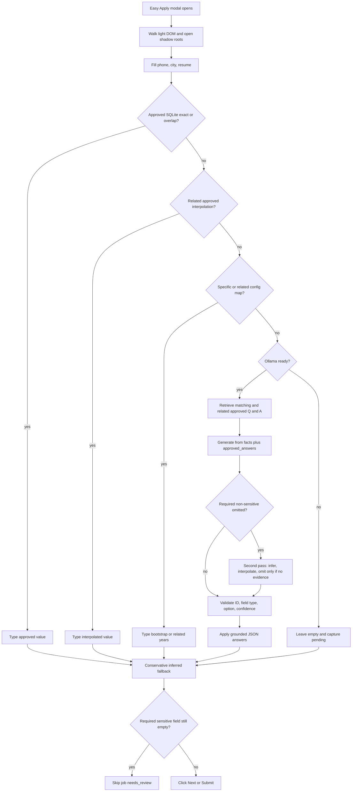
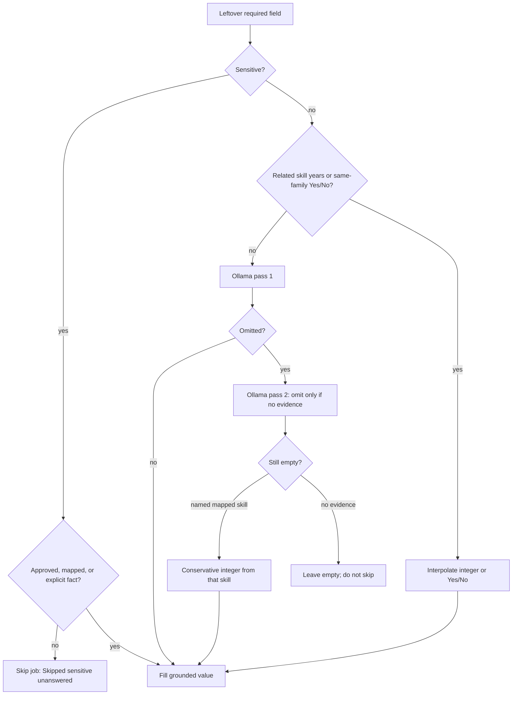
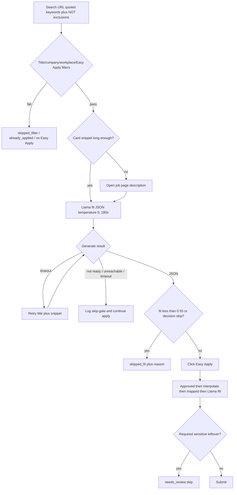
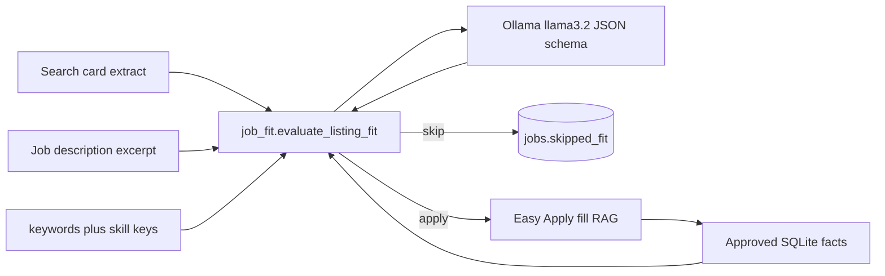
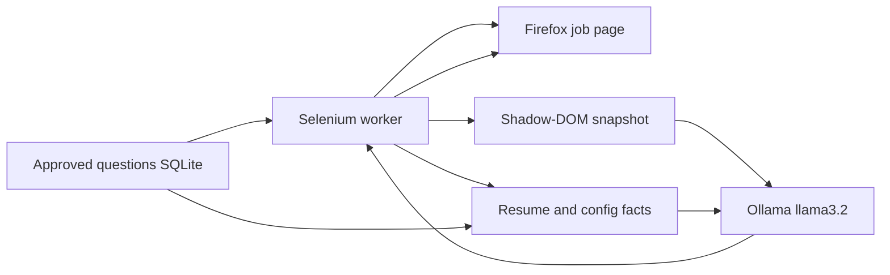
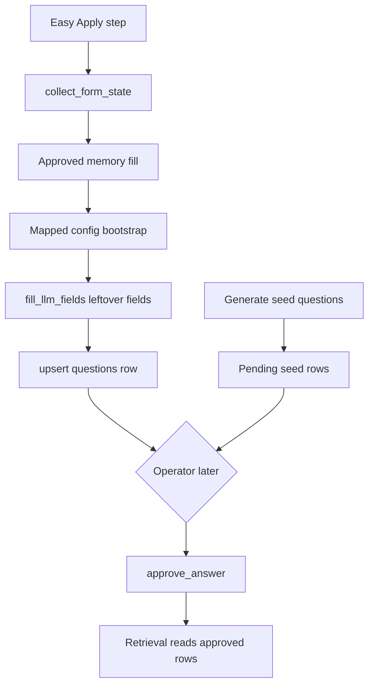
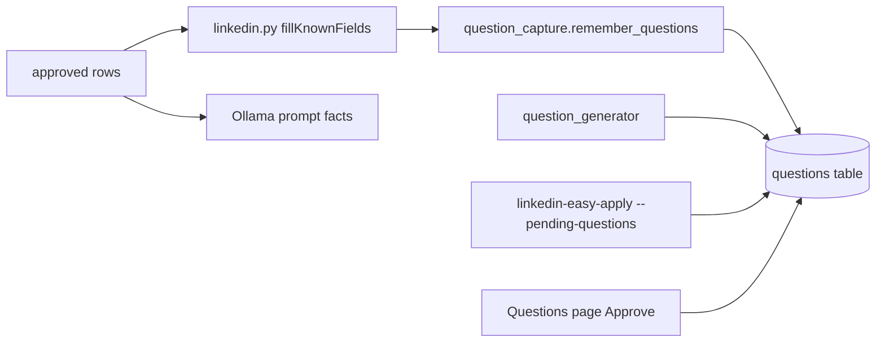
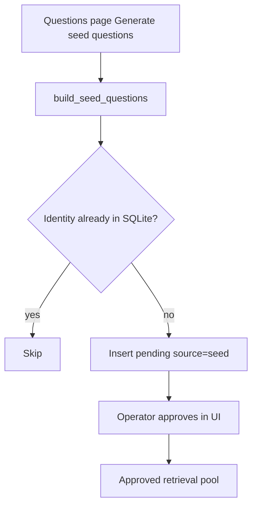
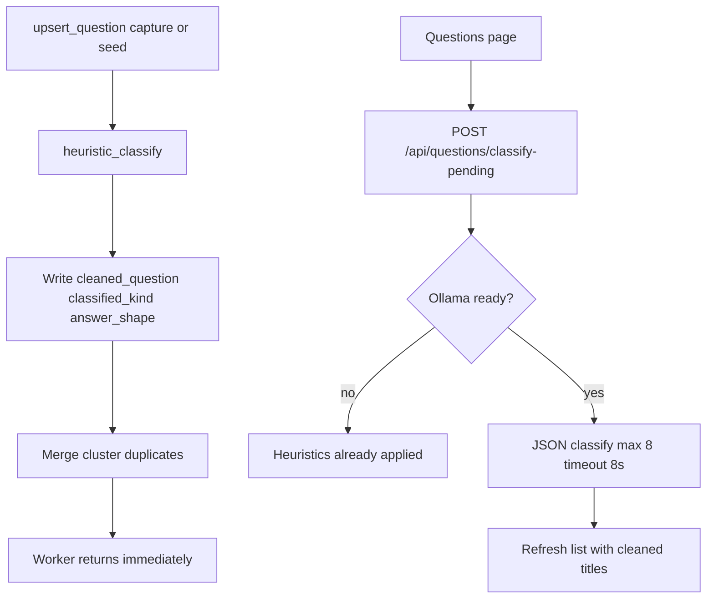
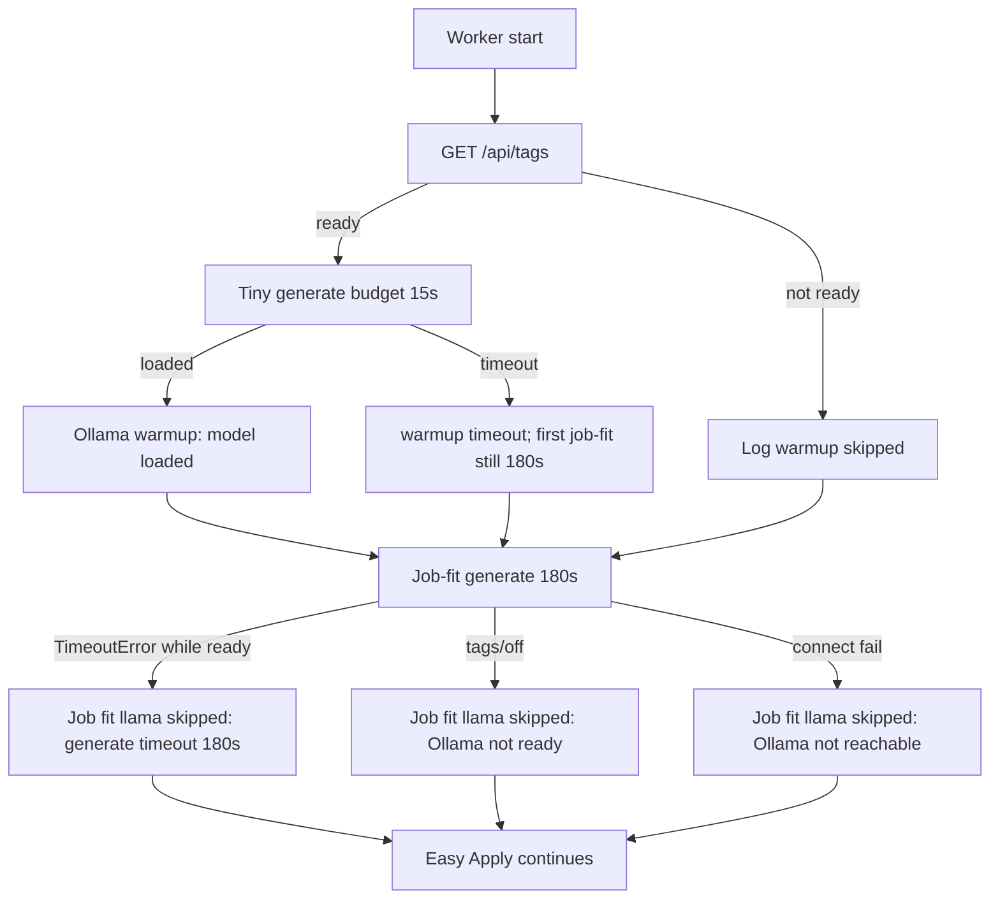

# Local Llama sidecar

## Feature purpose

Let a local Llama model running in Ollama read leftover Easy Apply fields and
suggest short answers from resume facts, config bootstrap maps, and
**operator-approved Q&A memory**. The Selenium worker still clicks and types.
The model does not talk to LinkedIn and does not leave this machine.

This is **retrieve-then-generate**, not training. Approving answers in the
dashboard grows a SQLite lookup table. It does **not** fine-tune Ollama, apply
LoRA, export a GGUF, or change `llama3.2` weights.

## Scope

In scope: Ollama on `127.0.0.1:11434`, shadow-DOM field collection, JSON answers
for Yes/No, years, short text, and native selects, SQLite retrieval of approved
rows, pending seed questions generated for the operator to approve, and a
**job-fit gate** that scores listings from search-card or job-page text.

Out of scope: cloud LLMs, CAPTCHA solving, inventing employer essays, submitting
answers that are not grounded in local facts, fine-tuning, LoRA, and any form of
model training. Operator review is `GET/POST /api/questions*`. Approved rows are
mappings for retrieval, not training data.

## Inputs and outputs

| Input | Purpose |
|---|---|
| `LINKEDIN_LLM` | `auto` (default), `ollama`, or `off` |
| `OLLAMA_HOST` | Default `http://127.0.0.1:11434` |
| `OLLAMA_MODEL` | Default `llama3.2`. Use `llama3.2-vision` to send a screenshot. Dashboard **Settings** or SQLite `operator_settings.ollama_model` overrides this when set |
| `LINKEDIN_APPLICANT_SUMMARY` | Optional extra truthful facts for short text questions |
| `LINKEDIN_JOB_FIT_THRESHOLD` | Skip the listing when Llama fit is below this. Default `0.55` |
| `LINKEDIN_JOB_FIT_TIMEOUT_SEC` | Job-fit generate timeout. Default `180`. Minimum `90` on CPU llama3.2. Form-fill generate stays 90s |
| Resume PDF | Text extract for leftover generation and seed-tool hints |
| `config.py` `keywords` / `years_experience` keys | Compact fit-profile skills and search keywords |
| `config.py` `years_experience` / `yes_no_answers` | **Bootstrap keyword maps**, used only when no approved row matches |
| Approved dashboard answers | Operator-confirmed mappings in SQLite `questions` |

Outputs: filled form controls, plus `skipped_fit` / `needs_review` job rows.
If Ollama is down, the worker still uses approved memory, interpolated related
answers, then bootstrap maps, and **does not skip the whole run**. The fit gate
is skipped. Only leftover **sensitive** required fields skip that one job.

## Dependencies

- Ollama installed locally
- A pulled model such as `llama3.2`
- Optional `pypdf` for resume text (installed with the project)

## Fill and memory order

Worker fill order on each Easy Apply step:

1. **Approved RAG memory** — `Store.retrieve_approved_answers` for the current
   field. Exact `normalized_question` wins; otherwise a conservative token overlap
   is used so "SQL years" does not match "Python years".
2. **Interpolated retrieval** — related approved answers when exact/overlap miss.
   Skill years may copy an integer from a nearest related skill (Databricks from
   Spark/PySpark) with an `Interpolated years X from Y` note. Same-family Yes/No
   may copy an approved value. Work authorization and sponsorship stay distinct:
   never interpolate one from the other.
3. **Mapped config bootstrap** — specific skill years and specific Yes/No keyword
   rules in `config.py`. If the question names a mapped skill, that integer is
   used. If that key is missing, the nearest related family member is used.
   There is still no global `years_experience["default"]` (no invented 9).
4. **Ollama first pass** — leftover unanswered fields. The prompt includes a
   compact `approved_answers` slice plus resume/config facts. Llama may infer
   short text (400 character cap) from `resume_text` and approved snippets, and
   interpolate related skill years. It must omit legal, demographic, salary,
   clearance, and sponsorship facts that are not in those sources.
5. **Ollama second pass** — if the first pass omitted **required non-sensitive**
   fields. Prompt: infer only from `applicant_facts` and `approved_answers`;
   interpolate related skill years; omit only if there is no evidence.
6. **Conservative inferred fallback** — still-empty required non-sensitive fields
   may take a grounded integer from a *specific* mapped skill named in the
   question (or its related family). Unknown skills stay empty.
7. **Skip the job** — only if a **required sensitive** field is still empty
   (`needs_review`, log `Skipped sensitive unanswered`). Non-sensitive required
   fields with no evidence stay empty and do **not** abandon the application.



## Inference versus skip policy

### Feature purpose

Raise Easy Apply completion rate by letting Llama **infer and interpolate**
grounded leftover answers instead of abandoning the job whenever Ollama omits a
field. The worker still refuses to invent legal, demographic, salary, clearance,
or sponsorship facts.

### Scope

In scope: related skill-year interpolation, same-family Yes/No interpolation,
short-text summaries from `resume_text` plus approved snippets (400 character
cap), a second Ollama pass for required non-sensitive leftovers, a conservative
mapped-skill fallback, and skip-only-sensitive `needs_review`.

Out of scope: fine-tuning, a global `years_experience["default"]` of 9, inferring
sponsorship from work authorization, and logging resume body text.

### Inputs and outputs

| Input | Purpose |
|---|---|
| `years_experience` skill keys | Exact integer, then nearest related family member |
| Approved SQLite answers | Exact, overlap, then interpolated related rows |
| `resume_text` / `applicant_facts` | Evidence for short text and second-pass inference |
| `is_sensitive_question` | Sponsorship, authorization, salary, clearance, demographics |

Outputs: filled integers/Yes-No/short text, log lines `Inferred: …`,
`Interpolated years X from Y`, and `Skipped sensitive unanswered`. Empty
non-sensitive required fields continue. Empty sensitive required fields skip
the job as `needs_review`.

### Functional flow



### Architecture

`linkedin_easy_apply.inference` owns skill families, Yes/No families, integer
coercion, and leftover detection. `store.match_approved_answers` calls it after
exact/overlap. `linkedin.py` logs notes without resume text. `llm.answer_unanswered`
runs the second generate only when required non-sensitive fields were omitted.

### Failure paths

- No evidence for a non-sensitive field: leave empty, capture pending, continue.
- Sensitive required still empty after retrieval/maps: skip `needs_review`.
- Ollama down: interpolation and mapped related years still run; no second pass.
- Unknown skill such as COBOL: never filled with a global 9.

### Security considerations

Sponsorship, work authorization, salary, clearance, disability, race, gender,
and veteran questions are never inferred from a related family that is not
theirs. Resume text is not written to event logs.

### Performance considerations

Interpolation is in-process and cheaper than generate. The second Ollama pass
runs only for omitted required non-sensitive leftovers on that step, same
temperature 0 JSON schema as the first pass.

## Job-fit scoring

### Feature purpose

Use the same local Llama sidecar to skip junk listings after deterministic
title/company/Easy Apply filters pass. The model returns a grounded fit score
from applicant keywords, `years_experience` skill keys, and approved facts.
It does not invent experience and it is not fine-tuned.

### Scope

In scope: temperature-0 JSON `{fit, reason, decision}` against a compact listing
payload, skip when `fit < 0.55` or `decision=skip`, persist `skipped_fit` with
the skip reason and optional `jobs.fit_score`, and a `last_fit` field on
`GET /api/status`. Prefer search-card snippet so junk is not opened; if that
snippet is shorter than 80 characters, score the job-page description **before**
Easy Apply is clicked.

Out of scope: fine-tuning, cloud scoring, blocking the run when Ollama is down,
and restyling the dashboard.

### Inputs and outputs

| Input | Purpose |
|---|---|
| Search-card `{title, company, snippet}` | Preferred. Sibling owns pre-click extract |
| Job-page description excerpt | Fallback when the card snippet is too short |
| `config.keywords` | Applicant search keywords |
| `years_experience` keys | Top skills (catchall `default` omitted) |
| Approved SQLite facts | Compact RAG slice, not the full history |
| `LINKEDIN_JOB_FIT_THRESHOLD` | Default `0.55` |
| `LINKEDIN_JOB_FIT_TIMEOUT_SEC` | Default `180`, floored at `90` |

Outputs: log lines `Job fit llama=0.82 apply` or
`Job fit llama=0.21 skip: staffing recruiter`. Skip rows use status
`skipped_fit`. Apply continues and stores `fit_score` on the later job row.

### Dependencies

Same local Ollama process as form RAG. `linkedin_easy_apply.job_fit` calls
`llm.generate_json_result` with a fit schema and a 180s timeout (form fill keeps
its own 90s client). Search-card HTML parsing stays in `job_card.py`.

### Functional flow



### Architecture



Fit scoring and form fill share Ollama and approved memory. They do not share
prompts. Fit never receives resume PDF text. Form fill still receives resume
facts for leftover short answers.

### Failure paths

- `LINKEDIN_LLM=off`: log `Job fit llama skipped: Ollama not ready` and continue.
  The run does not stop. `skip_job` stays false, so Easy Apply still runs when
  deterministic filters already passed.
- Ollama unreachable: `Job fit llama skipped: Ollama not reachable`. Same continue.
- Model missing: `Job fit llama skipped: model missing`. Same continue.
- Generate urllib timeout: `Job fit llama skipped: generate timeout (180s)`. This is
  not "not ready" while `status().ready` is true. One retry uses a title+snippet
  prompt; if that also times out, still apply.
- Invalid JSON or missing `fit`: treat as gate skipped, do not skip the job.
- Short card snippet: `needs_description`; worker scores after the description
  is on the page, still before Easy Apply.
- Required **sensitive** form field with no grounded answer: skip that job as
  `needs_review`. Required non-sensitive leftovers are inferred or left empty.

### Security considerations

The fit prompt contains only title, company, a short snippet, keywords, skill
keys, and approved Q&A. Cookies, passwords, and the resume file are not sent.
Keep `OLLAMA_HOST` on localhost.

### Performance considerations

Fit uses `num_predict=160` and a 180s timeout so CPU `llama3.2` can ingest a
~1000 token prompt (about 30s) plus generate without a urllib timeout being
misread as Ollama down. Form-fill generate stays on the 90s Ollama client.
Worker startup runs a cheap `GET /api/tags` and an optional tiny generate
(budget 15s) so the first listing is not a cold ingest. On timeout the gate
retries once with title+snippet only. Human pacing remains the larger delay.
Scoring from card text avoids opening junk pages when the sibling extract
already has a usable snippet.

Weights stay frozen. Growing memory still means approving Questions rows.

## Architecture



The browser session never includes the model. Ollama only receives form text,
optional screenshot bytes, and the local applicant fact bundle. Cookies and
passwords are not sent. Weights stay frozen.

## What "memory" means

Memory is reviewed SQLite retrieval (RAG over your approved Q&A). It is not:

- Fine-tuning
- LoRA
- Continued pretraining
- Updating Ollama model files

Growing memory means approving more rows. The next matching form looks those
rows up. Llama still generates only for leftovers, and must copy an approved
value when a retrieved row matches.

### Two ways questions enter the catalog

| Path | How it gets there | What you do |
|---|---|---|
| LinkedIn capture | Every Easy Apply step upserts visible screening fields | Approve (or reject) the real wording you just saw |
| Seed generator | Dashboard **Generate seed questions** inserts common Easy Apply patterns, one years prompt per `years_experience` skill, plus resume-tool prompts | Same review: type or confirm an answer, then Approve |

Both paths insert **pending** rows. Seeds never write `approved_value`. Until you
approve a row, it is not in the retrieval pool and cannot fill a live form via RAG.

## Screening question memory

This SQLite catalog is **memory and retrieval, not model training**. Captured
rows let you approve answers later and let the worker and Llama look up those
approved answers. Nothing here fine-tunes Ollama or leaves this machine.

### Feature purpose

Persist every Easy Apply screening question the worker sees, plus optional seed
prompts, so unanswered prompts can be answered by the operator and reused on
later applications.

### Scope

In scope: upsert into `data/assistant.sqlite` `questions`, operator approval via
the Questions page / `Store.approve_answer` / CLI, approved-row reads for
retrieval, and pending seed generation.

Out of scope: Ollama pulls, fine-tuning, and starting LinkedIn from the
dashboard.

### Inputs and outputs

| Input | Purpose |
|---|---|
| Form fields from `fillKnownFields` | Question text, kind, options, required, mapped/LLM/unanswered/approved tags |
| Seed generator | Common Easy Apply, skill-year, sponsorship, work-auth, relocation, resume-tool prompts |
| `job_id`, company, title | Last job where a LinkedIn-captured question was seen |
| Operator approve in UI or `--approve-question ID --answer TEXT` | Promotes a pending row into the retrieval pool |

Outputs: one `questions` row per unique `(normalized_question, field_kind,
option_set_hash)`. Repeats increment `seen_count` and keep the first raw wording.
JSONL `data/question_capture.jsonl` remains a value-free audit log beside this
table. Seed re-runs skip existing identities instead of flooding duplicates.

### Dependencies

- Worker `Store` (same SQLite file as jobs/events)
- `linkedin_easy_apply.question_capture.remember_questions`
- `linkedin_easy_apply.question_generator.generate_seed_questions`
- Dashboard Questions page; optional CLI

### Functional flow



Capture is triggered at the end of each modal step in `Linkedin.fillKnownFields`
after approved fills, mapped fills, and `fill_llm_fields`. `source` is
`mapped`, `llm`, `unanswered`, `manual`, or `seed`. File and password controls
are skipped. Email/phone `proposed_value` is stored as `[redacted-email]` /
`[redacted-phone]`. Resume text and page HTML are never written to this table.

### Architecture



### Schema and migration

The capture schema is the source of truth. New databases run `QUESTIONS_DDL`.
Existing capture tables are never rebuilt: missing columns such as `reuse_count`
are added with `ALTER TABLE`. Identity stays unique on
`(normalized_question, field_kind, option_set_hash)`. Older databases that still
CHECK `source` without `seed` store generator rows as `source=manual` with
`provenance=seed`.

Columns: `id`, `normalized_question`, `raw_question`, `field_kind`, `options_json`,
`option_set_hash`, `required`, `job_id`, `company`, `title`, `source`
(`mapped|llm|unanswered|manual|seed`), `proposed_value`, `approved_value`,
`approval_status` (`pending|approved|rejected`), `provenance`, `confidence`,
`seen_count`, `reuse_count`, `last_seen_at`, `created_at`, plus classification
columns `cleaned_question`, `classified_kind`, `answer_shape`, `cluster_key`,
`merged_into_id`, `classification_status`, `not_user_answerable`. Unique index:
`idx_questions_identity`. Display title is `cleaned_question`; identity stays on
the captured `raw_question`.

### Failure paths

- No `Store` on the worker (unit tests): capture is skipped.
- Empty or file/password fields: not inserted.
- Unknown question id on `--approve-question`: CLI exits 2.
- Approved rows keep `approved_value` when the same prompt is seen again.
- Seed generation skips an identity that already exists, including LinkedIn-captured rows.

### Security considerations

Do not store passwords, resume text, or HTML snapshots in `questions`. Redact
email and phone in `proposed_value`. Live events still log counts only. Seed
`proposed_value` hints copied from config are still pending until you approve
them.

### Performance considerations

One indexed upsert per visible field per modal step. Seed generation is a single
pass over a small catalog and the unique identity index. Identity lookup is a
unique index, not a table scan.

### How to review and approve

In the dashboard: open **Questions**, filter to pending, type or confirm the
answer, click **Approve**. That row becomes retrieval memory.

```powershell
linkedin-easy-apply --pending-questions
linkedin-easy-apply --approve-question 12 --answer Yes
```

Retrieval calls `Store.list_approved_questions()` then matches the current
unanswered fields (exact normalized question, then conservative token overlap)
via `Store.retrieve_approved_answers(questions)`. That compact slice is injected
into the local prompt as `approved_answers` with `source_id` values. Direct
worker fills use the same lookup **before** config maps.

## Seed questions

### Feature purpose

Grow the review queue with likely Easy Apply prompts **before** LinkedIn shows
them, so you can approve a truthful library. This is catalog growth, not
training.

### Scope

In scope: pending rows for sponsorship, work authorization, relocation,
common workplace Yes/No prompts, one years question per `years_experience`
key (never the removed `default` catch-all), and extra tool prompts scanned
from resume text when available.

Out of scope: auto-approval, writing `approved_value`, calling Ollama, or
submitting LinkedIn applications.

### Inputs and outputs

| Input | Purpose |
|---|---|
| `config.py` skill years | One pending "How many years of {skill}…" prompt per key |
| Common Easy Apply list | Sponsorship, work auth, relocate, on-site/hybrid/remote, and similar |
| Resume extract | Additional tool year / "do you have experience with {tool}" prompts |

Outputs: `{ inserted, skipped, candidates, source }` from
`POST /api/questions/generate-seeds`. Re-running skips existing
`(normalized_question, field_kind, option_set_hash)` rows.

### Functional flow



### Failure paths

- Duplicate identity: counted in `skipped`, no second row.
- Missing resume: skill-year and common patterns still insert; resume-tool extras are omitted.
- Existing DBs that reject `source=seed`: rows store as `manual` with `provenance=seed`.

### Security considerations

Seeds are local SQLite rows. They do not upload the resume. `proposed_value` may
copy a config hint (for example SQL years) but `approved_value` stays empty.
Sensitive live answers still require operator approval before retrieval.

### Performance considerations

Generation is one indexed existence check per catalog item. Re-runs are
idempotent and do not bump `seen_count` for existing identities.

## Question classification (normalize before answering)

### Feature purpose

Correct poorly typed LinkedIn captures **before** they appear in the Questions
queue. Email must show as an email/text field, years as a number, and Yes/No as
yes/no — not a generic string. Wording is cleaned. Duplicates are merged. This
is classification only. It does **not** invent answers and does **not**
fine-tune Ollama.

### Scope

In scope: heuristic classification on every `upsert_question` (LinkedIn capture
or seeds), optional Ollama wording polish from the dashboard, duplicate merge
by cluster, and hiding file/resume plus merged rows from `list_questions`.

Out of scope: fine-tuning, answering the field, starting Easy Apply, or blocking
the Selenium worker on Llama.

### Inputs and outputs

| Input | Purpose |
|---|---|
| `raw_question`, `field_kind`, `options` | Captured LinkedIn or seed prompt |
| Heuristic rules | Fast kind + cluster without Ollama |
| Ollama JSON (optional) | `{cleaned_question, kind, answer_shape, duplicate_of_id?, confidence}` |

Outputs written on the same SQLite row: `cleaned_question` (display title),
`classified_kind`, `answer_shape`. `raw_question` is unchanged. Duplicates get
`merged_into_id` and `classification_status=duplicate`. File/resume rows are
`not_user_answerable`.

Allowed `kind`: `email`, `tel`, `number`, `text`, `select`, `textarea`,
`yes_no`, `file`, `date`, `unknown`. Email uses `answer_shape=text`.

### Classification rules

- **email / e-mail / email address** (or options that are `[email]`,
  `Select an option`, `email addresses`, or a single email-looking token) →
  `email`, display `Email`, cluster `email`, `answer_shape=text`. LinkedIn's
  native `select` kind is never kept for these rows.
- **phone / mobile / telephone** (or `[phone]` placeholder options) → `tel`,
  display `Phone`, cluster `tel`
- Repeated capture labels are collapsed (`Email address` ×3 → `Email`)
- **city / location** with placeholder-only options → `text`, not `select`
- **years of experience / how many years** → `number` (not “years of age”)
- **yes/no options, authorized, sponsorship, willing to** → `yes_no`
- **resume / cv / curriculum vitae** → `file`, hidden from the pending queue
- Everything else keeps light whitespace cleanup and the captured kind when it
  is already one of the allowed kinds and the option list has real choices

Email variants such as “Email address”, “Email address” repeated, and “Email”
share cluster `email` and merge into one visible row (`seen_count` summed).
`GET /api/questions` and `classify-pending` backfill rows that were already
stored as `select`.

### Dependencies

Heuristics: none. Ollama polish: local `llama3.2` on `127.0.0.1:11434`, same as
the fill sidecar. Temperature 0. Prompt forbids inventing an answer.

### Functional flow



Worker upsert never calls Ollama. `GET /api/questions` is not a pure read:
it calls `repair_contact_classifications` on the **live** `assistant.sqlite`
so LinkedIn email/phone placeholder-selects become `email`/`tel` text rows
before the list is returned. **Refresh the Questions page** after a capture
or after upgrading to see cleaned title **Email** and an `<input type="email">`
instead of a select of `[email]`. `classify-pending` still polishes leftover
wording (max N, timeout per question) without blocking the worker.

### Architecture summary

`question_classifier.classify_question_with_llm(row)` is background-safe: no
Selenium, no LinkedIn. Heuristic first. Llama optional. Persistence is
`Store.save_question_classification` plus `merge_duplicate_question`.

### Failure paths

- Ollama down or `LINKEDIN_LLM=off`: email/phone/years still classify; UI works.
- Llama returns an answer-like value (Yes/No, a bare number, an email): discarded;
  heuristic wording is kept.
- Unknown `kind` from Llama: heuristic kind is kept.
- Duplicate merge never deletes rows; `list_questions` hides them.
- `classify-pending` SQLite busy: HTTP 503. Easy Apply is not started.

### Security considerations

Classification JSON has no `value`/`answer` field. Email/phone `proposed_value`
is re-redacted when kind becomes `email`/`tel`. File/resume rows are not shown
for answering. No fine-tune, no cloud LLM, no LinkedIn calls.

### Performance considerations

Heuristic classify is regex-only and runs inside upsert (target well under
200ms). Ollama classify is dashboard-only, `timeout=8s`, `num_predict=120`,
max 8 rows per `classify-pending` request so the worker never waits on Llama.

## Answer retrieval (how Llama remembers)

Memory is a reviewed SQLite table. We are not training, fine-tuning, or applying
LoRA to Ollama. The frozen `llama3.2` weights stay unchanged.

Retrieve-then-generate:

1. Approved SQLite answers fill first when they match the live field (exact,
   then conservative overlap, then related interpolation).
2. Specific `config.py` maps fill next, including related skill years. They are
   a bootstrap, not a trained policy. Generic experience→Yes and default→N years
   are omitted. Unknown skills are never filled with 9.
3. For leftover fields, `Store.retrieve_approved_answers` keeps rows that match
   the current questions. Exact `normalized_question` wins; otherwise a
   high-precision token overlap; otherwise related skill years or same-family
   Yes/No. Sponsorship is never taken from a work-authorization row.
4. Only that compact slice (default 12) is injected as `approved_answers` with
   `source_id` and optional interpolation `note`. `applicant_facts["approved_answers"]`
   carries the same slice, never the whole history.
5. First-pass prompt: use `approved_answers` when present; interpolate related
   skill years; summarize short text from resume snippets; omit sensitive facts
   that are not in sources. Second pass (required non-sensitive leftovers only):
   infer only from `applicant_facts` and `approved_answers`; omit only if no
   evidence. Return `confidence` and `source_ids`. Existing `q0` question ids stay.
6. Typed LLM values are tagged `_llm_value` and upserted at the end of
   `fillKnownFields` as `source=llm`, `approval_status=pending`. Email/phone
   `proposed_value` is redacted. Sponsorship, authorization, salary, disability,
   race, gender, veteran, and clearance are never auto-approved.
7. If the application later succeeds and the answer was already approved or
   exact-mapped, `reuse_count` increments. LLM proposals stay pending.

How to grow it: approve pending rows (captured or seeded) from the dashboard.
The next matching form retrieves those rows automatically.

## Failure paths

- Ollama not installed or not running: worker continues with approved memory and
  mapped bootstrap answers and logs `Job fit llama skipped: Ollama not reachable`
  (or `Ollama not ready` when `LINKEDIN_LLM=off`) plus `Ollama skipped: local
  model is not ready` on form fill. The run does not stop.
- Model missing: Ollama is marked not ready, reports the required `ollama pull`
  command, and fit logs `Job fit llama skipped: model missing`; no generation
  request is attempted.
- Fit generate timeout: logs `Job fit llama skipped: generate timeout (180s)`,
  retries once with a shorter title+snippet prompt, then continues Easy Apply.
- The model returns an unknown question ID, a non-numeric value for a number field,
  or a value outside a select/radio option list: that answer is discarded.
- The model omits a question or returns an essay longer than 400 characters: that field
  is left empty. Required **non-sensitive** leftovers get a second infer pass, then a
  conservative mapped-skill fallback. Required **sensitive** leftovers skip the job as
  `needs_review` (`Skipped sensitive unanswered`).
- Fit JSON is invalid: the gate is skipped and Easy Apply may still run.
- Closed shadow roots are walked with WebDriver `element.shadow_root`. A vision model plus
  screenshot remains a fallback when a nested closed tree still cannot be serialized.

Live-run events expose only counts and state: whether Ollama was invoked or skipped and
why, plus accepted/applied/rejected answer totals, `Inferred: {question}`,
`Interpolated years X from Y`, and `Skipped sensitive unanswered`. Generated values,
resume text, and contact values are intentionally omitted.

## Security considerations

Keep `LINKEDIN_LLM=auto` pointed at localhost. Do not point `OLLAMA_HOST` at a remote
URL that would upload the resume. The sidecar never receives `LINKEDIN_PASSWORD`.
Operator-approved answers stay on this machine and are not used to fine-tune the model.

## Performance considerations

Each unanswered form step can add a few seconds while Llama generates JSON. Human pacing
is still the larger delay. Prefer `llama3.2` (text) over vision unless selectors keep
missing the modal. Approved memory fills are a SQLite lookup and are cheap compared
with generation.

## Troubleshooting

False `Job fit llama skipped: Ollama not ready` after a ~25s urllib timeout used
to mean CPU `llama3.2` was still ingesting while `GET /api/tags` already said
ready. That is **not** Ollama down. The three skip strings are distinct:

| Log line | Meaning | Operator action |
|---|---|---|
| `Job fit llama skipped: Ollama not ready` | `LINKEDIN_LLM=off` or status is unknown/not ready | Leave LLM on `auto` unless you meant to disable it |
| `Job fit llama skipped: Ollama not reachable` | `/api/tags` or generate could not connect | Start Ollama from the dashboard; do not assume a timeout |
| `Job fit llama skipped: generate timeout (180s)` | Ollama was ready; `/api/generate` hit the job-fit timeout | Easy Apply still runs. Raise `LINKEDIN_JOB_FIT_TIMEOUT_SEC` only if 180s is not enough. Check FIT ticker `error_kind=timeout`, not the LLM chip |

`GET /api/status` `last_fit.error_kind` is `timeout` or `unreachable`.
`llm.ready` / `llm.detail` stay `model present` on a generate timeout so the
header LLM chip does not look down. `llm.last_fit_error` repeats the class.

Worker start probes `/api/tags` and may run a tiny generate (15s budget), logged
as `Ollama warmup: model loaded` or `Ollama warmup: generate timeout (15s); first
job-fit may be slow`. Warmup never pulls models and never blocks more than ~15s.



Keep `LINKEDIN_JOB_FIT_TIMEOUT_SEC` at least 90 on CPU; default is 180. Form-fill
generate stays 90s on its own client. Regression: `pytest tests -q`.

## How to run

1. Install Ollama from https://ollama.com/download once.
2. Open `Start-Dashboard.cmd` and click **Start run**. That starts `ollama serve` and
   pulls `llama3.2` if it is missing. You do not need `Start-Ollama.cmd`.
3. The header LLM chip should say ready. `linkedin-easy-apply --check` is optional.
4. On **Questions**, optionally click **Generate seed questions**, then approve
   answers you want in RAG memory.
5. To use another local tag, set `OLLAMA_MODEL` in `.env` (for example
   `llama3.2-vision`) or pick/pull a tag on dashboard **Settings**. That writes
   SQLite `operator_settings.ollama_model`; `.env` is the fallback.

Offline regression for picker/chat/resume is `python -m pytest tests -q`
(`tests/test_models_settings.py`). Those tests mock `/api/tags` and `/api/chat`;
they do not `ollama pull` large models.

Optional vision:

```powershell
ollama pull llama3.2-vision
```

Set `OLLAMA_MODEL=llama3.2-vision` in `.env`. The worker then attaches a screenshot of
the current form.
