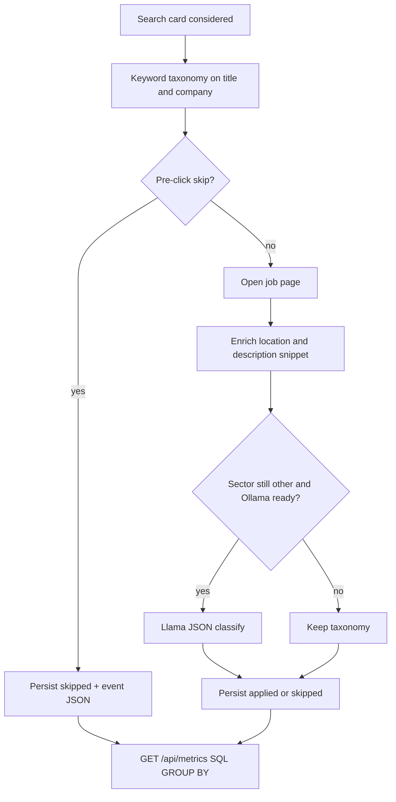
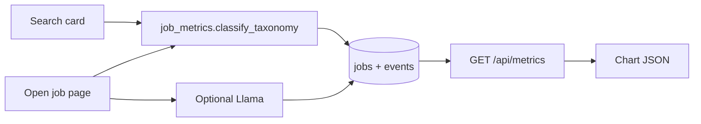

# Operator job metrics

## Feature purpose

Persist where the bot is spending attention: job location, industry sector and
market, and whether each considered listing was applied or skipped. The operator
console charts this JSON; the worker writes it as each card or job is decided.

## Scope

In scope:

- `jobs.location_text`, `sector`, `market`, `outcome`, `metrics_json`
- the same fields on skip/apply event `payload_json`
- keyword taxonomy from title + company + description snippet
- optional Llama classify only when Ollama is ready **and** the job page is
  already open
- backfill of recent SQLite rows that already have title/company
- `GET /api/metrics` aggregations for today and the last 7 days

Out of scope: opening extra job pages to classify, restyling the dashboard,
LinkedIn's official industry API.

## Inputs and outputs

| Input | Purpose |
|---|---|
| Search card title, company, location | Classify and persist skips before click |
| Job page title, company, location, description snippet | Enrich after the page is already open |
| Job status | Map to outcome `applied` / `skipped` / `failed` / `seen` |
| Optional Ollama JSON | Fill `other` only when the page is already open |

Outputs: one `jobs` row per LinkedIn job id, skip-event JSON, and:

`GET /api/metrics`

```json
{
  "source": "store",
  "today": {"since": "...", "until": "...", "totals": {}, "by_sector": [], "by_market": [], "by_location": [], "by_outcome": []},
  "last_7_days": {"since": "...", "until": "...", "totals": {}, "by_sector": [], "by_market": [], "by_location": [], "by_outcome": []},
  "taxonomy": {"sectors": [], "markets": [], "outcomes": ["applied", "skipped", "failed", "seen"]},
  "applied_vs_skipped": {"applied": 0, "skipped": 0, "failed": 0},
  "sectors": [],
  "markets": [],
  "locations": []
}
```

Histogram rows use `key` (SQL) and `label` (chart alias). Counts are
`applied` / `skipped` / `failed` / `seen` / `count`.

## Schema

`jobs` columns added (existing DBs get `ALTER TABLE`):

| Column | Type | Role |
|---|---|---|
| `location_text` | TEXT | Operator-facing location; copied from `location` when empty |
| `sector` | TEXT | Coarse industry: healthcare, finance, insurance, government, staffing, technology, other |
| `market` | TEXT | Finer bucket: hospital, health, bank, fintech, insurance, government, staffing, recruiting, software, data, other |
| `outcome` | TEXT | `applied`, `skipped`, `failed`, `seen` |
| `metrics_json` | TEXT | Snapshot of the same fields plus `source` (`taxonomy` or `llm`) |

Skip events store the same snapshot in `events.payload_json`. `job_id`, `title`,
and `company` already exist on `jobs`.

Indexes: `idx_jobs_seen_at`, `idx_jobs_seen_outcome`, `idx_jobs_sector`,
`idx_jobs_market`. `idx_jobs_seen_outcome` is **not** part of the initial
`CREATE TABLE` script. Legacy databases created before metrics lack `outcome`;
`CREATE TABLE IF NOT EXISTS` would not add the column, and creating that index
in the same script aborted dashboard startup. Init now ALTERs additive columns,
then creates the index only if `outcome` exists. See [architecture](architecture.md#sqlite-schema-migration).

## Taxonomy

Company/industry keywords win over title skills so a software role at a hospital
stays healthcare.

| Market | Sector | Keywords (word-boundary) |
|---|---|---|
| hospital | healthcare | hospital, medical center |
| health | healthcare | healthcare, health, clinic, medical, pharma, biotech, nursing, unitedhealth, cigna |
| bank | finance | bank, banking, jpmorgan, goldman sachs, fidelity, blackrock |
| fintech | finance | fintech, financial technology |
| insurance | insurance | insurance, insurer, underwriting, actuarial |
| government | government | government, public sector, department of, municipal, usajobs |
| staffing | staffing | staffing, rpo, robert half, insight global, epam |
| recruiting | staffing | recruiting, recruiter, recruitment, talent acquisition |
| software | technology | software, developer, programmer, devops, saas |
| data | technology | data engineer, data scientist, data analyst, databricks, snowflake, data |
| other | other | no keyword match |

## Dependencies

- `linkedin_easy_apply.store.Store`
- `linkedin_easy_apply.job_card` for search-card HTML (sibling pre-click filters)
- `linkedin_easy_apply.llm.generate_json` only when `already_open` and taxonomy is `other`
- Dashboard `GET /api/metrics` / nested `metrics` on `/api/status` and `/api/jobs`

## Functional flow





## Failure paths

- Missing title/company: no backfill; sector stays empty until a later upsert.
- Taxonomy miss: `other`. Llama is not called unless the page is already open.
- Ollama down or invalid JSON: keep `other`. The apply run continues.
- Legacy SQLite without the new columns: `Store.initialize` ALTERs them in, then
  backfills up to 2000 recent rows with title or company.
- Empty window: zeroed `totals` and empty arrays.
- Dashboard `GET /api/metrics` 500: Live and Applications show empty histograms
  and keep the rest of the page. Do not add a second metrics URL.

## Security considerations

- Localhost only, same as the rest of the dashboard.
- Llama classify prompt is title, company, and snippet. No resume, cookies, or
  `.env`.
- Metrics JSON does not include screening answers.

## Performance considerations

- Persist is one write per considered job (same transaction as today's upsert).
- Aggregations are three SQL `GROUP BY` scans filtered by `seen_at`, not a
  Python loop over history.
- Llama classify is skipped for card-only skips and for any job the taxonomy
  already labeled. That avoids extra LinkedIn navigation and extra model calls.

## Troubleshooting

- `/api/metrics` `source` is `store` when columns exist. `derived` is the
  in-memory fallback if `job_metrics` is missing.
- Backfill did not fill a row: that row has empty title and company (common for
  old skip-by-id log lines).
- Sector looks wrong for a SWE at a bank: company industry is intentional so
  operator metrics show *where* applications land.
