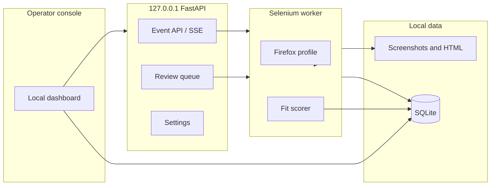

# Smarter assistant and operator console

This is the product plan for making the local Easy Apply assistant more selective,
observable, and recoverable. Secrets stay in `.env`. The browser profile stays on
this machine. Unknown screening questions are still never guessed.

## Feature purpose

Turn the current keyword-and-console worker into an operator desk:

- score jobs against the resume before applying
- record every outcome in a queryable store
- show live progress and past applications in a local UI
- pause for human answers instead of aborting the whole form

## Scope

In scope: local SQLite history, localhost dashboard, fit scoring, review queue,
start/stop from the UI, crash resume, daily caps, and export.

Out of scope: cloud hosting, LinkedIn unofficial APIs, CAPTCHA bypass, inventing
employer-specific essays, and raising apply volume.

## Current gaps

| Gap | Today | Replacement |
|---|---|---|
| Job fit | Title substring lists | Resume-vs-description score and disqualifiers |
| Questions | Unknown required fields abort | UI inbox; answer once; reuse the mapping |
| History | `data/Applied Jobs DATA - YYYYMMDD.txt` | SQLite row per job id with status and artifacts |
| Control | Dashboard start/stop, Login, live events, search | Needs-review pause still pending |
| Settings | Console Settings: model picker, resume upload, caps, local-tz schedule | Search keywords still live in `config.py` |
| Safety | Caps exist; marionette crashes kill the run | Session health + resume from last job id |

## Architecture



Stack choice: FastAPI + SQLite + a small HTML/HTMX dashboard in the same Python
venv. No extra Node toolchain. Bind to `127.0.0.1` only. Double-click
`Start-Dashboard.cmd`.

Tradeoff: a React SPA would look denser, but HTMX keeps one runtime, one test
story, and easier Windows install. Revisit SPA only if the dashboard outgrows
server-rendered pages.

## Data model

`data/assistant.sqlite` (gitignored, like the rest of `data/`):

- `jobs`: job_id, title, company, location, location_text, sector, market,
  outcome, workplace, url, fit_score, status, reason, seen_at, applied_at,
  metrics_json. Operator metrics (sector/market/location/outcome) are filled
  from a keyword taxonomy at persist time and backfilled on store open.
- `events`: run_id, timestamp, level, job_id, message, payload_json
- `runs`: run_id, started_at, stopped_at, status, applied_count, skipped_count
- `questions`: durable Easy Apply screening memory. Unique on
  `(normalized_question, field_kind, option_set_hash)`. Columns include raw/normalized
  question, options, required, last job_id/company/title, source
  (`mapped|llm|unanswered|manual|seed`), proposed_value, approved_value, approval_status
  (`pending|approved|rejected`), provenance, confidence, seen_count, last_seen_at,
  created_at. Existing unused `questions(answer, source_job_id)` tables are rebuilt on
  `Store.initialize()` (rename to `questions_legacy`, `CREATE` new, copy, drop). This is
  operator memory/RAG, not model training. See [llm.md](llm.md).
- `quota`: date, applied_count

Statuses: `seen`, `skipped_filter`, `skipped_fit`, `needs_review`, `applied`,
`failed`, `already_applied`, `page_timeout`.

Migrate existing daily text logs on first dashboard start so history is not lost.

## Dashboard screens

1. **Live run** — status, remaining quota, current job, event timeline, pause/stop.
2. **Applications** — searchable table of all outcomes; open LinkedIn; open screenshot.
3. **Needs review** — unknown questions and borderline-fit jobs waiting on you.
4. **Diagnostics** — failure HTML/PNG, last WebDriver error, profile lock.
5. **Settings** — **Done for overlay.** Console `/models` edits Ollama model,
   resume PDF (`data/resumes/`), daily/run caps, and local-timezone schedule.
   Search keywords / remote / salary still live in `config.py`.

## Smarter apply loop

1. Dedup by LinkedIn job id.
2. Wait until the job title or Easy Apply control exists. If neither loads, status `page_timeout`.
3. Extract description text from the job page.
4. Score against the resume (Azure/SQL/ADF/Databricks, seniority, remote/hybrid,
   intern/clearance/on-site disqualifiers). Threshold is configurable.
5. Easy Apply only when score is high. Borderline goes to Needs review.
6. Fill approved SQLite memory first, then specific mapped config fields. Leftover
   short questions can be answered by a local Ollama/Llama sidecar from resume,
   config facts, and `approved_answers` in the prompt. Long employer essays are
   still skipped. This is retrieval, not fine-tuning.
7. After apply or skip, emit an event and persist the row before the next job.

A local Llama sidecar is documented in [llm.md](llm.md). Cloud models are out of scope.

## Build order

0. SQLite event log and importer for current `.txt` files. **Done.**
1. Local dashboard with live run and application history. **Done.** See [dashboard documentation](dashboard.md).
2. Fit scorer and duplicate suppression. **Done for fit scoring.** Local Llama
   job-fit gate; see [llm.md](llm.md). Duplicate suppression remains list-side.
3. Needs-review pause/resume.
4. Settings UI: Ollama picker, resume upload, daily/run caps, local-timezone
   schedule. **Done** for those controls. Search-filter YAML overlay still open.
5. Flavor: daily briefing, company memory, crash resume, CSV export.

## Flavor

- Daily briefing of yesterday's applies, skip reasons, and remaining quota.
- Company memory: pin wanted employers, demote staffing mills from outcomes.
- Crash resume from last job id after marionette failure.
- Attention inbox for screenshots, checkpoints, and pending questions.
- CSV export without resume bytes or cookies.
- Quiet hours so runs stay inside a local daytime window (`RunScheduler` uses
  machine local timezone; Settings Schedule writes the windows).

## Failure paths

- Dashboard cannot start the worker if the Firefox profile is locked; show that
  on Diagnostics instead of hanging.
- Worker crash marks the run `crashed` and leaves artifacts on disk.
- SQLite migrate failure keeps the old text logs readable.
- Review queue timeout: the job stays `needs_review` and the worker moves on or
  pauses, depending on a setting (default: pause).

## Security

- Listen on localhost only.
- Do not send the resume, cookies, or `.env` to the browser except filename and
  non-secret settings.
- Review answers are local mappings, same policy as `config.py`.
- Caps remain the default; the UI can lower them, not remove the warning.

## Performance

Fit scoring is in-process on already-downloaded job HTML. No extra LinkedIn
calls. The dashboard reads SQLite; the worker writes with a short transaction
per job. Human pacing stays the rate limiter, not the UI.

## Tests

- Event schema round-trip and log importer.
- Fit scorer: senior Azure/SQL JD matches; intern/warehouse/clearance rejected.
- Review queue: unknown question does not submit; saved answer is reused.
- API: history filter, quota remaining, start rejected when profile locked.
- UI smoke: dashboard renders empty-history and live-run fixtures.

## How to run after it exists

```powershell
.\Start-Dashboard.cmd
```

Opens `http://127.0.0.1:8787`. Click **Start run**. Existing `Start-Bot.cmd` remains as a
headless fallback only.
