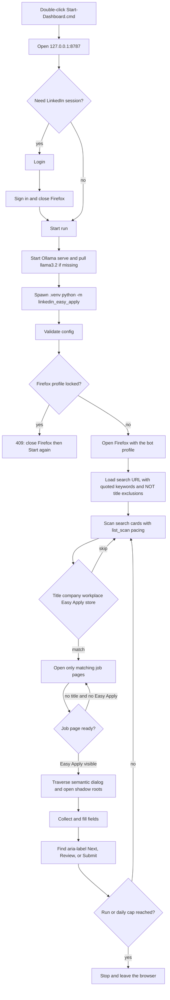
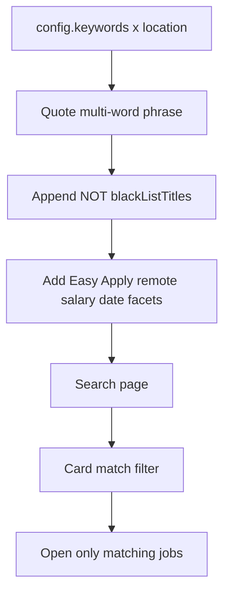
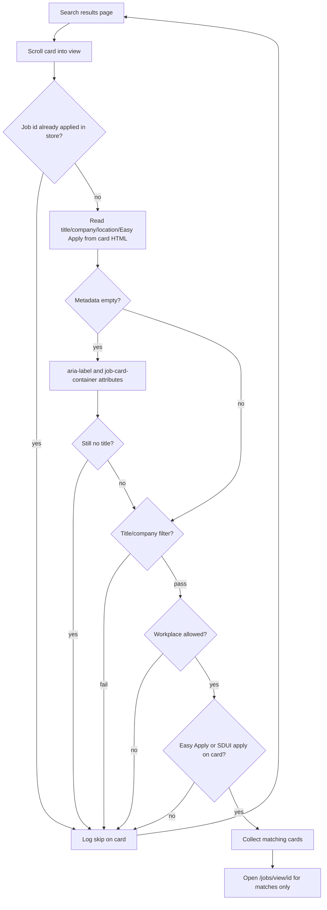

# Running the assistant

## Feature purpose

Make startup reliable on Windows and keep Easy Apply traffic slow enough to resemble a person
reviewing jobs, so the operator does not have to remember PowerShell path rules or run the bot at
machine speed.

## Scope

In scope: `Start-Dashboard.cmd` as the daily launcher, one-click Start run (Ollama then
worker), dashboard Login (same as `--login`), Firefox profile-lock detection, human
delays, typing cadence, and daily/run application caps.

Out of scope: bypassing CAPTCHA, 2FA, or LinkedIn rate limits. `Start-Bot.cmd`,
`Start-Ollama.cmd`, and `Login-LinkedIn.cmd` are optional fallbacks only.

## Inputs and outputs

| Input | Purpose |
|---|---|
| Double-click `Start-Dashboard.cmd` | The only required shortcut. Console at http://127.0.0.1:8787. **Start run** starts Ollama then the worker. **Login** opens the bot Firefox profile |
| `LINKEDIN_PACE` | `human` (default) or `fast` |
| `LINKEDIN_MAX_APPLICATIONS_PER_RUN` | Stop after this many successful applies in one run (default 12) |
| `LINKEDIN_MAX_APPLICATIONS_PER_DAY` | Stop after this many successful applies in a **local** calendar day (default 25) |

Outputs: live console logs, `data/` audit files, `data/application_quota.json`, append-only
`data/question_capture.jsonl` metadata, and SQLite `questions` rows for operator approval.

## Dependencies

- Project `.venv`
- Firefox with `FIREFOX_PROFILE_PATH`
- LinkedIn session already saved in that profile
- Optional local Ollama. Dashboard Start run launches it when `LINKEDIN_LLM` is not `off`.
  That keeps `llama3.2` in RAM (often 2GB+) until you Stop Ollama. `Start-Ollama.cmd` is only
  a manual fallback.

## Functional flow

## Failure paths

- Missing `.venv` prints install commands and waits for a key.
- A locked Firefox profile asks the operator to close those windows.
- A job page without a title is not treated as a filter miss **after the search card
  already matched**. If an in-app apply control is visible, the bot still applies. Cards
  with no readable title (even after aria-label / `job-card-container` fallbacks) are
  skipped on the list and never opened. If both title and apply control are missing on a
  page that did open, it records `page_timeout` and saves `data/job_load_<id>.png` plus
  `.html` for the Diagnostics page.
- LinkedIn often labels the in-app button `Apply` or `LinkedIn Apply`, not `Easy Apply`. The
  worker treats `#jobs-apply-button-id` / `.jobs-apply-button` as Easy Apply unless the page
  says already applied or the click opens an external site.
- Redesigned forms live below `#interop-outlet[data-testid="interop-shadowdom"]` in a **closed**
  shadow root. `driver.page_source` serializes an empty host. The worker reads `element.shadow_root`
  through WebDriver, recursively pierces nested closed shadows (contact comboboxes), and identifies
  the form by dialog semantics, Apply to / Contact info copy, a progress bar (including 0%), footer
  actions, and accessible names. Exact `aria-label="Next"` is enough; visible button text is not
  required. Generated ember CSS classes are not used. The job-page carousel control
  `data-testid="carousel-inline-right-button"` is not an Easy Apply Next.
- If the modal is visible but no enabled Next/Review/Submit is found, the recorded reason says so.
  It does not fall back to a generic unanswered-field message built from labels. Diagnostics use
  `easy_apply_failure_<job>_<UTC timestamp>.png/.html` plus `_modal.html` serialized from the closed
  shadow tree, so retries do not overwrite evidence. Contact field values are masked in screenshots
  and redacted from saved HTML.
- Live events report modal detection, Next/Review/Submit detection, field and mapped-answer counts,
  Ollama invocation/skip reasons, and accepted/applied/rejected answer counts. They never include
  answer values or resume text.
- Every modal step appends question metadata to `data/question_capture.jsonl` and upserts
  screening rows into SQLite `questions`. JSONL never stores answer values. SQLite stores
  redacted proposed values and operator-approved answers for later retrieval. Email/phone
  proposed values are redacted; passwords, resume text, and page HTML are not stored.
- `already_applied` is recorded when the search card footer says Applied, when SQLite
  already has `applied` / `already_applied` for that job id, or when the opened listing
  itself says the user already applied. Store hits skip without opening the job page.
- Unknown screening questions still stop that application and save diagnostics.
- Caps stop the run before high-volume submitting.
- A local Ollama model is started from the dashboard Start run button when it is not already
  reachable. If Ollama is down, approved SQLite memory and mapped bootstrap answers still
  apply; leftover required questions skip the job. See [llm.md](llm.md) and
  [dashboard.md](dashboard.md).
- One-click Ollama uses RAM while the model stays loaded. Stop the worker without stopping Ollama
  if you want the next Start run to skip the cold load. Use Stop Ollama to free memory.

## Security considerations

The launcher does not store passwords. It reuses the dedicated Firefox profile. Caps reduce, but do
not eliminate, the chance that LinkedIn restricts automated activity.

## Performance considerations

Human pacing is intentional and slow: about 10-22 seconds on a job page, 18-40 seconds after a
successful apply, plus a longer pause every 7 **opened** jobs. Search-card skips never load the
job URL; they still take the shorter skip delay. Throughput is far lower than the old 1-2 second
loop. That is the point.

## Caps and local timezone

Caps count **successful applies**. Search-card skips and `needs_review` do not
consume quota. The daily counter uses the operator's **local calendar date**
(`datetime.now(timezone.utc).astimezone().date()`), not UTC. Remaining quota is
`min(run_left, day_left)`.

SQLite `operator_settings` overrides the two cap integers when set from
**Settings → Caps**. `.env` remains the fallback. Daily count is the operator's
**local calendar date**.

## Schedule windows

### Feature purpose

Auto Start/Stop the owned worker inside local-timezone windows so runs stay
inside a daytime band. Empty windows keep **manual Start run only**.

### Scope

In scope: Settings **Schedule** chips + start/end, `schedule_windows` JSON,
`RunScheduler` (default 20s tick) started by `run_dashboard`. Out of scope:
stopping Ollama when a window closes.

Windows use the machine local timezone (`datetime.now().astimezone()`), not UTC.
Monday=0. `00:00`–`23:59` is treated as all day. `start == end` disables that
window. Overnight windows wrap midnight. A closed window stops the **owned
worker tree only**.

## Match-first search URLs

### Feature purpose

Ask LinkedIn for the jobs the operator actually wants before the worker walks a result
page. Unquoted keywords match scattered tokens in titles **and** descriptions, so a
`Data Engineer` search fills the list with unrelated Engineer roles. The URL builder now
sends a quoted phrase plus Boolean `NOT` terms from `blackListTitles`, so fewer junk
cards ever appear.

### Scope

In scope: `utils.search_keyword_query` and `LinkedinUrlGenerate.generateUrlLinks`.
Out of scope: dashboard editing of keywords, LinkedIn job-title ID (`f_T`) filters.

### Inputs and outputs

| Input | Purpose |
|---|---|
| `config.keywords` | Positive phrase, quoted when it contains spaces |
| `config.blackListTitles` | Boolean `NOT intern`, `NOT "entry level"`, … |
| Existing `f_AL`, location, experience, remote, salary, date, sort | Unchanged LinkedIn facets |

Output: `data/urlData.txt` URLs such as
`keywords=%22Data%20Engineer%22%20NOT%20intern`. Operator logs still show the positive
phrase via `urlToKeywords`.

### Dependencies

- LinkedIn job search Boolean operators (`"` and `NOT`)
- `config.py` search policy

### Functional flow

### Failure paths

- LinkedIn applies `NOT` to the whole posting, not only the title. A Data Engineer role
  whose description mentions an intern program can disappear. Remove that token from
  `blackListTitles` if recall drops too far.
- A blacklist token that is part of the keyword itself (searching `Junior Data Engineer`
  with `junior` blocked) is not appended, so the URL does not cancel itself.
- If LinkedIn ignores Boolean in `keywords=`, card-side filters still reject junk.

### Security considerations

Search URLs contain only public job-search policy. No cookies or credentials.

### Performance considerations

Phrase + `NOT` cuts result volume at LinkedIn, so the worker paginates fewer 25-card
pages (each page still waits 6-12s to load). This is the cheapest filter: no job-view
delay and no Llama call.

## Search-card skip before open

### Feature purpose

Stop the worker from opening LinkedIn job pages that already fail the operator's title,
company, workplace, Easy Apply, or already-applied rules. After the list is scanned, the
apply loop iterates **only** matching cards.

### Scope

In scope: reading title, company, location, and Easy Apply / SDUI apply signals from each
`li[data-occludable-job-id]` card; aria-label and `job-card-container` fallbacks; SQLite
already-applied checks; workplace vs `config.remote`; logging `Skipped before open: …`
on the card; `list_scan` pacing while reading the list.

Out of scope: dashboard redesign and application caps.

### Inputs and outputs

| Input | Purpose |
|---|---|
| Search-result card light DOM | Title, company, location, Easy Apply badge, Applied state, SDUI `openSDUIApplyFlow` href |
| `config.onlyApplyTitles` / `blackListTitles` | List-side title allow/deny |
| `config.blacklist` / `onlyApply` | List-side company allow/deny |
| `config.remote` | Skip On-site cards when only Remote/Hybrid are allowed |
| SQLite `jobs` | Skip ids whose status is `applied` or `already_applied` |

Outputs: audit lines `Skipped before open: <reason>. Job: <url>`, a page summary
`opening N matching job(s) out of M cards`, SQLite statuses `skipped_filter`,
`already_applied`, or `failed` (no Easy Apply / off-site). Matching Easy Apply cards
are the only ones that call `driver.get` on `/jobs/view/{id}`.

### Dependencies

- Search results still use the URLs from `utils.LinkedinUrlGenerate`
- `linkedin_easy_apply.job_card` parses sanitized card HTML
- `Store.get_job` for prior applies
- `linkedin_easy_apply.pacing` `list_scan` vs `skip` / `job_view`

### Functional flow

### Failure paths

- Occluded cards are scrolled into view for up to two seconds. If title is still blank, the card
  is skipped as unknown. The worker does not open it to discover that it is junk.
- Title blacklist (`intern`, `staffing`, …) and `onlyApplyTitles` run on the card text, so a
  Data Engineer search does not open Intern or Warehouse titles.
- Location text that is explicitly On-site is skipped when `config.remote` is Remote/Hybrid.
  Cards with no workplace remain eligible until the job page says otherwise.
- Missing Easy Apply on the card is a skip, including "Apply on company website".
- Caps are unchanged: skipped cards do not count as successful applies.

### Security considerations

Card HTML is logged only as title/company/job id. Tracking query strings from hrefs are not
written to the audit line beyond the canonical `/jobs/view/{id}` URL.

### Performance considerations

Rejected cards use `list_scan` (0.2-0.5s) instead of `skip` (3.5-8s) or `job_view`
(10-22s). A page of 20 mismatches used to wait more than a minute of skip delays before
opening the two real matches; it now scans the list and opens only those two. Human
`skip` pacing still applies after a job page has been opened and then abandoned.

